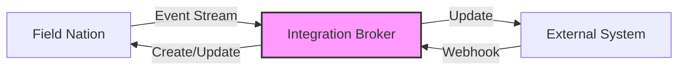
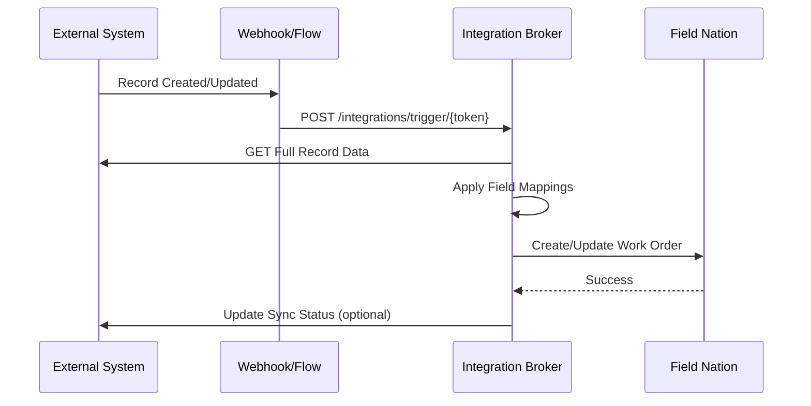
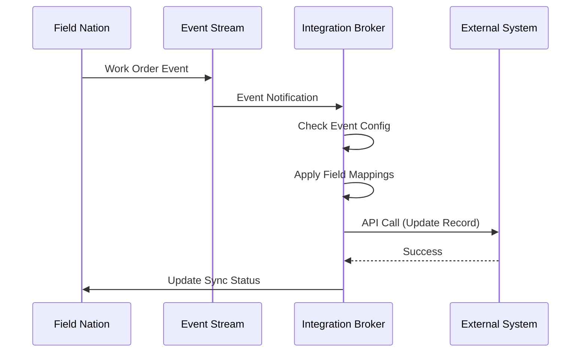

## Event-Driven Architecture

When work orders change in Field Nation, events trigger outbound synchronization to external systems. When external records change, webhooks trigger inbound synchronization to Field Nation.



---

## Available Events

Field Nation publishes events for key work order lifecycle milestones. Configure which events trigger synchronization for each connector.

### Work Order Creation & Status

<TypeTable
  type={{
    "FN_WO_CREATED": {
      type: "event",
      description: "Work order first created (may skip draft and go directly to published/routed)"
    },
    "FN_WO_DRAFT": {
      type: "event",
      description: "Work order set to draft status after creation"
    },
    "FN_WO_PUBLISHED": {
      type: "event",
      description: "Work order published and made available to providers"
    },
    "FN_WO_APPROVED": {
      type: "event",
      description: "Work order approved and ready for execution"
    },
    "FN_WO_DELETED": {
      type: "event",
      description: "Work order soft-deleted (set to delete status)"
    }
  }}
/>

---

### Provider Assignment

<TypeTable
  type={{
    "FN_WO_ROUTED": {
      type: "event",
      description: "Work order routed to a provider (fires per provider - routing to 10 providers = 10 events)"
    },
    "FN_WO_STATUS_ROUTED": {
      type: "event",
      description: "Work order status changed to routed (fires once regardless of provider count)"
    },
    "FN_WO_ASSIGNED": {
      type: "event",
      description: "Work order assigned to provider (via routing acceptance or direct assignment)"
    },
    "FN_WO_CONFIRMED": {
      type: "event",
      description: "Assigned provider confirmed acceptance"
    },
    "FN_WO_DECLINED": {
      type: "event",
      description: "Provider declined work order (fires per decline)"
    },
    "FN_WO_UNDECLINED": {
      type: "event",
      description: "Provider removed decline status"
    }
  }}
/>

---

### Work Execution

<TypeTable
  type={{
    "FN_WO_ON_MY_WAY": {
      type: "event",
      description: "Provider marked status as 'on my way' to site"
    },
    "FN_WO_PROVIDER_CHECKED_IN": {
      type: "event",
      description: "Provider checked in (fires per check-in if multiple)"
    },
    "FN_WO_PROVIDER_CHECKED_OUT": {
      type: "event",
      description: "Provider checked out (fires per check-out if multiple)"
    },
    "FN_WO_TASK_COMPLETED": {
      type: "event",
      description: "Individual task within work order completed"
    },
    "FN_WO_DONE": {
      type: "event",
      description: "Provider marked entire work order as completed"
    }
  }}
/>

---

### Schedule & Timeline

<TypeTable
  type={{
    "FN_WO_SCHEDULE_UPDATED": {
      type: "event",
      description: "Schedule modified (date, time, or duration changed)"
    },
    "FN_WO_DELAYED": {
      type: "event",
      description: "Work order delayed (typically on-hold status)"
    },
    "FN_WO_POSTPONED": {
      type: "event",
      description: "Work order postponed indefinitely"
    },
    "FN_WO_AT_RISK": {
      type: "event",
      description: "System detected work order at risk of not completing on time"
    }
  }}
/>

---

### Updates & Changes

<TypeTable
  type={{
    "FN_WO_UPDATED": {
      type: "event",
      description: "Basic work order information changed (title, description, core fields)"
    },
    "FN_WO_CUSTOM_FIELD_VALUE_UPDATED": {
      type: "event",
      description: "Any custom field value updated"
    },
    "FN_WO_SHIPMENT_UPDATED": {
      type: "event",
      description: "Shipment information modified"
    },
    "FN_WO_INTEGRATION_STATUS_UPDATED": {
      type: "event",
      description: "Integration-specific status field changed"
    },
    "FN_WO_ALERTS_SENT": {
      type: "event",
      description: "Alert notifications sent for work order"
    }
  }}
/>

---

### Messages & Communication

<TypeTable
  type={{
    "FN_WO_MESSAGE_ADDED": {
      type: "event",
      description: "New message added to work order thread"
    },
    "FN_WO_TASK_MESSAGE_ADDED": {
      type: "event",
      description: "Message added to specific task within work order"
    },
    "FN_WO_CLOSE_OUT_ADDED": {
      type: "event",
      description: "Close-out information or notes added"
    }
  }}
/>

---

### Financial Events

<TypeTable
  type={{
    "FN_WO_PAYMENT_APPROVED": {
      type: "event",
      description: "Payment for work order approved"
    },
    "FN_WO_EXPENSE_ADDED": {
      type: "event",
      description: "Expense item added to work order"
    },
    "FN_WO_COUNTER_OFFER": {
      type: "event",
      description: "Provider submitted counter-offer for payment terms"
    }
  }}
/>

---

### Additional Events

<TypeTable
  type={{
    "FN_WO_ATTACHMENT_ADDED": {
      type: "event",
      description: "File or attachment added to work order"
    },
    "FN_WO_CANCELLED": {
      type: "event",
      description: "Work order cancelled"
    },
    "FN_WO_PENDING_QUALIFICATIONS": {
      type: "event",
      description: "Work order has pending qualification requirements"
    },
    "FN_WO_PROBLEM_REPORTED": {
      type: "event",
      description: "Issue or problem reported on work order"
    }
  }}
/>

---

## Configuring Event Triggers

### Selecting Events

In the Integration Broker UI, configure which events trigger synchronization:

<Steps>

### Navigate to Event Configuration

Go to your connector settings → Event Triggers section

### Select Events

Check the events you want to trigger outbound sync:
- ✅ `FN_WO_ASSIGNED` - Sync when provider assigned
- ✅ `FN_WO_DONE` - Sync when work completed
- ✅ `FN_WO_APPROVED` - Sync when work approved

### Configure Action

For each event, specify the action:
- **Update Record** - Update existing external record
- **Create Record** - Create new external record (typically for messages/notes)
- **Custom Script** - Run platform-specific logic

### Save Configuration

Test event triggers with sample work orders

</Steps>

---

### Common Event Configurations

**Minimal Sync (Status Only)**
- `FN_WO_ASSIGNED` - Provider assigned
- `FN_WO_DONE` - Work completed
- `FN_WO_APPROVED` - Work approved

**Standard Sync (Status + Communication)**
- All minimal sync events
- `FN_WO_MESSAGE_ADDED` - Sync messages
- `FN_WO_SCHEDULE_UPDATED` - Sync schedule changes
- `FN_WO_CUSTOM_FIELD_VALUE_UPDATED` - Sync custom fields

**Comprehensive Sync (Full Lifecycle)**
- All standard sync events
- `FN_WO_ON_MY_WAY` - Provider en route
- `FN_WO_PROVIDER_CHECKED_IN` - Check-in tracking
- `FN_WO_PROVIDER_CHECKED_OUT` - Check-out tracking
- `FN_WO_PAYMENT_APPROVED` - Financial tracking
- `FN_WO_ATTACHMENT_ADDED` - Document sync

---

## Synchronization Patterns

### Inbound: External System → Field Nation

External systems trigger synchronization via webhooks:



**Triggers:**
- Record created in external system
- Record status changed
- Record field updated (specific fields)
- Manual "Sync to Field Nation" button

---

### Outbound: Field Nation → External System

Field Nation events trigger synchronization:



**Triggers:**
- Configured Field Nation events
- Status changes
- Custom field updates
- Message additions

---

## Event Payloads

Events include complete work order context:

```json
{
  "event_type": "FN_WO_ASSIGNED",
  "event_timestamp": "2025-01-15T14:30:00Z",
  "workorder": {
    "id": 12345678,
    "title": "On-site Network Installation",
    "status": {
      "id": 2,
      "name": "assigned"
    },
    "assignee": {
      "user": {
        "id": 987654,
        "first_name": "John",
        "last_name": "Technician",
        "email": "john@example.com",
        "phone": "+1-555-0100"
      }
    },
    "schedule": {
      "service_window": {
        "start": {
          "utc": "2025-01-20 09:00:00"
        },
        "end": {
          "utc": "2025-01-20 12:00:00"
        }
      }
    },
    "pay": {
      "type": "fixed",
      "amount": 250.00
    },
    "custom_fields": [ /* ... */ ]
  },
  "correlation_id": "ext-record-456"
}
```

---

## Best Practices

### Event Selection

<Accordions type="multiple">
  <Accordion title="Start with Core Events">
    Begin with minimal sync (assigned, done, approved). Add more events after core sync is stable.
    
    **Phase 1**: Status changes only  
    **Phase 2**: Add messages and schedule updates  
    **Phase 3**: Add comprehensive tracking (check-in, expenses, etc.)
  </Accordion>
  
  <Accordion title="Avoid Redundant Events">
    Some events overlap. Choose the most specific event for your use case:
    
    - Use `FN_WO_STATUS_ROUTED` (once) instead of `FN_WO_ROUTED` (per provider) if you only need to know routing occurred
    - Use `FN_WO_ASSIGNED` if you don't need separate confirmation tracking
  </Accordion>
  
  <Accordion title="Consider Event Volume">
    High-frequency events can overwhelm external APIs:
    
    - `FN_WO_MESSAGE_ADDED` - Can fire frequently
    - `FN_WO_PROVIDER_CHECKED_IN/OUT` - Multiple per work order
    - `FN_WO_UPDATED` - May fire for many field changes
    
    Ensure your external system can handle the volume or implement batching.
  </Accordion>
</Accordions>

---

### Synchronization Strategy

**Bidirectional Consistency**
- Map statuses bidirectionally (FN → External and External → FN)
- Use correlation IDs to track related records
- Handle sync conflicts (last-write-wins or manual resolution)

**Idempotency**
- Ensure same event processed multiple times produces same result
- Check correlation ID before creating new records
- Use upsert logic (create if not exists, update if exists)

**Error Handling**
- Configure retries for temporary failures
- Set up dead letter queue monitoring
- Alert on persistent sync failures

---

## Monitoring Event Sync

### Integration Logs

Track event processing in Integration Broker logs:

- Event received timestamp
- Field mappings applied
- API call made to external system
- Success/failure status
- Error details (if failed)

### Health Metrics

Monitor key indicators:

- **Event Processing Rate**: Events/minute
- **Success Rate**: % successful syncs
- **Average Latency**: Time from event to external update
- **Error Rate**: % failed syncs
- **Queue Depth**: Pending events in queue

---

## Troubleshooting Events

<Accordions type="multiple">
  <Accordion title="Events Not Triggering">
    **Check:**
    - Event enabled in connector configuration
    - Work order status actually changed to trigger event
    - Integration not paused/disabled
    - Event filters not excluding work order
    
    **Debug:**
    Review Integration Broker logs for event received confirmation
  </Accordion>
  
  <Accordion title="Events Triggering Multiple Times">
    **Causes:**
    - Some events naturally fire multiple times (ROUTED per provider, CHECK_IN per check-in)
    - Retry logic if external API failed
    - Webhook configured multiple times
    
    **Solution:**
    Implement idempotency in external system using correlation ID
  </Accordion>
  
  <Accordion title="External System Not Updating">
    **Check:**
    - Field mappings configured for outbound sync
    - External API credentials valid
    - Correlation ID linking FN work order to external record
    - External API not rate limiting
    
    **Debug:**
    Check Integration Broker logs for API call details and response
  </Accordion>
</Accordions>

[Complete troubleshooting guide →](/docs/connectors/concepts/troubleshooting)

---
