## What Are Pre-built Connectors?

Pre-built connectors are **configuration-driven integrations** managed by Field Nation's Integration Broker middleware. Instead of building custom API integrations, you configure field mappings and business rules through a web interface. Field Nation handles authentication, data transformation, retries, and error recovery automatically.

### Key Benefits

<Cards>
  <Card title="No Code Required" icon="Wand">
    Configure through UI - no API development needed for standard workflows
  </Card>
  <Card title="Maintained by Field Nation" icon="Shield">
    Updates, security patches, and API changes handled automatically
  </Card>
  <Card title="Built-in Error Handling" icon="RefreshCw">
    Automatic retries, dead letter queues, and detailed error logging
  </Card>
  <Card title="Bidirectional Sync" icon="ArrowLeftRight">
    Work orders flow both ways - create in either system, sync status automatically
  </Card>
</Cards>

---

## Supported Platforms

Field Nation provides pre-built connectors for 9 platforms:

<Tabs items={["PSA Platforms", "CRM & Ticketing", "Other Platforms", "REST Connector"]}>

<Tab value="PSA Platforms">

### Professional Services Automation

**Autotask** - Datto Autotask PSA integration for ticket and work order synchronization

**ConnectWise** - ConnectWise Manage integration for service ticket management

**ServiceNow** - ServiceNow ITSM for incident and work order management

[View all PSA connectors →](#platform-guides)

</Tab>

<Tab value="CRM & Ticketing">

### CRM & Support

**Salesforce** - Salesforce Service Cloud integration with Flows and Outbound Messages

**Freshdesk** - Freshdesk ticketing system integration

[View all CRM connectors →](#platform-guides)

</Tab>

<Tab value="Other Platforms">

### ERP & Project Management

**NetSuite** - NetSuite ERP integration for work order and service management

**Quickbase** - Bidirectional sync between Quickbase applications and Field Nation

**Smartsheet** - Smartsheet project management data synchronization

[View all platforms →](#platform-guides)

</Tab>

<Tab value="REST Connector">

### Universal Integration

**REST Connector** - Connect **any system** with an OpenAPI specification

- Upload your OpenAPI spec file
- Configure endpoints (create, read, update)
- Map fields through UI
- Basic authentication support

Perfect for systems not covered by out-of-the-box connectors.

[Learn more about REST Connector →](/docs/connectors/platforms/rest-connector/overview)

</Tab>

</Tabs>

---

## How Pre-built Connectors Work

```mermaid
sequenceDiagram
    participant Ext as External System
    participant Broker as Integration Broker
    participant FN as Field Nation
    
    Note over Ext,FN: Inbound: External System → Field Nation
    Ext->>Broker: Webhook/API Trigger
    Broker->>Ext: Fetch Full Record Data
    Broker->>Broker: Apply Field Mappings
    Broker->>Broker: Transform with JSONNET
    Broker->>FN: Create/Update Work Order
    
    Note over Ext,FN: Outbound: Field Nation → External System
    FN->>Broker: Work Order Event
    Broker->>Broker: Apply Reverse Mappings
    Broker->>Ext: Update Record via API
    Ext-->>Broker: Confirmation
```

<Steps>

### Configuration in Field Nation

Configure authentication credentials, specify the external object to integrate, and set up field mappings through the Integration Broker UI.

### External Platform Setup

Configure webhooks or triggers in your external system to notify Field Nation when records are created or updated.

### Automatic Synchronization

The Integration Broker handles bidirectional sync:
- Creates Field Nation work orders from external records
- Syncs status changes, assignments, and completions back to external system
- Maintains data consistency with automatic retries

</Steps>

---

## When to Use Pre-built Connectors

<Accordions type="multiple">
  <Accordion title="✅ Use Pre-built Connectors When">
    - Your platform is supported (Salesforce, ServiceNow, etc.)
    - You need standard work order synchronization
    - You want minimal development effort
    - You prefer configuration over coding
    - You need Field Nation to manage updates and maintenance
  </Accordion>
  
  <Accordion title="⚠️ Consider REST API + Webhooks When">
    - You need highly custom workflows
    - Your platform isn't supported by pre-built connectors
    - You require advanced data transformations beyond JSONNET
    - You want complete control over integration logic
    - You have development resources available
    
    [REST API + Webhooks Guide →](/docs/getting-started/choosing-your-approach)
  </Accordion>
  
  <Accordion title="💡 Use REST Connector When">
    - Your system has an OpenAPI specification
    - You need basic CRUD operations
    - You want configuration-driven approach
    - Your system isn't in the pre-built connector list
    
    [REST Connector Guide →](/docs/connectors/platforms/rest-connector/overview)
  </Accordion>
</Accordions>

---

## Common Use Cases

### Dispatch from CRM
Automatically create Field Nation work orders when a Case, Ticket, or Opportunity reaches a specific status (e.g., "On-site Required").

### Status Synchronization
Reflect work order status changes (assigned, in progress, completed) back to your originating system in real-time.

### Provider Communication
Sync comments and messages between Field Nation technicians and your internal team through the external platform.

### Financial Tracking
Update work order costs, invoices, and payment status in your ERP or accounting system automatically.

---

## Feature Comparison

| Feature | Pre-built Connectors | REST API + Webhooks |
|---------|---------------------|---------------------|
| **Setup Time** | Hours to days | Days to weeks |
| **Development Required** | Configuration only | Full development |
| **Customization** | High (via JSONNET) | Unlimited |
| **Maintenance** | Field Nation | Your team |
| **Cost** | Lower | Higher (dev time) |
| **API Updates** | Handled automatically | Manual updates |
| **Error Handling** | Built-in | Custom implementation |
| **Best For** | Standard workflows | Custom workflows |

[Compare all approaches →](/docs/getting-started/choosing-your-approach)

---

## Architecture Overview

Pre-built connectors use Field Nation's **Integration Broker** - a microservices-based middleware that:

- **Authenticates** with external platforms (OAuth, API keys, Basic Auth)
- **Discovers Fields** automatically from external system metadata
- **Transforms Data** using configurable field mappings and JSONNET
- **Queues Messages** with Redis for reliable delivery and retries
- **Handles Errors** with automatic retries, dead letter queues, and alerting

[Learn more about broker architecture →](/docs/connectors/concepts/broker-architecture)

---

## Getting Started

<Cards>
  <Card title="Prerequisites" icon="CircleCheck" href="/docs/connectors/getting-started">
    What you need before setting up a connector
  </Card>
  <Card title="Choose Your Platform" icon="LayoutGrid" href="#platform-guides">
    Select from 9 supported platforms
  </Card>
  <Card title="Configuration Guide" icon="Settings" href="/docs/connectors/concepts/field-mappings">
    Learn how to map fields and transform data
  </Card>
  <Card title="Troubleshooting" icon="Bug" href="/docs/connectors/concepts/troubleshooting">
    Common issues and solutions
  </Card>
</Cards>

---

## Platform Guides

Select your platform to get started:

<Cards>
  <Card title="Salesforce" icon="Cloud" href="/docs/connectors/platforms/salesforce/overview">
    Integrate with Salesforce Service Cloud
  </Card>
  <Card title="ServiceNow" icon="Server" href="/docs/connectors/platforms/servicenow/overview">
    Connect ServiceNow ITSM
  </Card>
  <Card title="Autotask" icon="Briefcase" href="/docs/connectors/platforms/autotask/overview">
    Sync with Datto Autotask PSA
  </Card>
  <Card title="ConnectWise" icon="Network" href="/docs/connectors/platforms/connectwise/overview">
    Integrate ConnectWise Manage
  </Card>
  <Card title="Freshdesk" icon="Ticket" href="/docs/connectors/platforms/freshdesk/overview">
    Connect Freshdesk ticketing
  </Card>
  <Card title="NetSuite" icon="DollarSign" href="/docs/connectors/platforms/netsuite/overview">
    Integrate NetSuite ERP
  </Card>
  <Card title="Quickbase" icon="Database" href="/docs/connectors/platforms/quickbase/overview">
    Sync Quickbase applications
  </Card>
  <Card title="Smartsheet" icon="Sheet" href="/docs/connectors/platforms/smartsheet/overview">
    Connect Smartsheet projects
  </Card>
  <Card title="REST Connector" icon="Code" href="/docs/connectors/platforms/rest-connector/overview">
    Universal OpenAPI-based integration
  </Card>
</Cards>

---

## Support & Resources

- **Support Portal**: [app.fieldnation.com/support-cases](https://app.fieldnation.com/support-cases)
- **Phone Support**: +1 877-573-4353 (24/7)
- **Status Page**: [status.fieldnation.com](https://status.fieldnation.com)

[Complete support resources →](/docs/resources/support)

---
