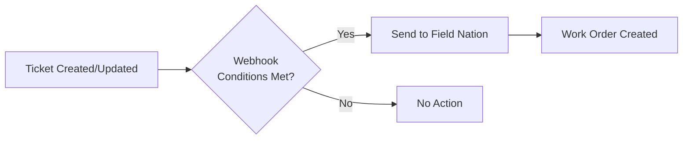

## Prerequisites

- ☐ Completed [Field Nation configuration](/docs/connectors/platforms/autotask/configuration)
- ☐ Field Nation trigger URL copied
- ☐ Autotask admin access
- ☐ Webhook configuration permissions

---

## Workflow Overview



**Webhook**: Monitors tickets and evaluates conditions  
**Trigger URL**: Destination for webhook notifications  
**Field Nation**: Fetches ticket data and creates work order

---

## Step 1: Configure Webhook in Autotask

<Steps>

### Navigate to Webhooks

Autotask → Admin → Webhooks

### Create New Webhook

Click **"New Webhook"** or **"Add Webhook"**

### Configure Webhook Settings

**Name**: `Field Nation Integration`

**Entity**: Select entity type (e.g., `Ticket`)

**Webhook URL**: Paste Field Nation trigger URL
```
https://api.fieldnation.com/integrations/trigger/{YOUR_CLIENT_TOKEN}
```

**HTTP Method**: `POST`

**Content Type**: `application/json`

</Steps>

---

## Step 2: Define Trigger Conditions

Configure when webhook fires:

### Event Types

Select events that should trigger:
- ☑ **Create** - New tickets
- ☑ **Update** - Ticket changes
- ☐ **Delete** - Usually not needed

---

### Filter Conditions

**Option 1: Status-Based**
```
Status = "Dispatch to Field"
```

**Option 2: Custom Field**
```
UDF "Send to Field Nation" = Yes
```

**Option 3: Queue-Based**
```
Queue Name = "Field Services"
AND Priority IN (Critical, High)
```

**Option 4: Issue Type**
```
Issue Type = "On-Site Required"
AND Status != "Cancelled"
```

---

### Webhook Payload

Configure what data to send:

**Minimal Payload (Recommended):**
```json
{
  "ticketId": "{TicketID}",
  "entityType": "Ticket",
  "action": "{Action}"
}
```

Field Nation will fetch complete ticket data via SOAP API.

**Why minimal?**
- Reduces payload size
- Ensures latest data (fetched at processing time)
- Prevents stale data issues

---

## Step 3: Test Webhook

<Steps>

### Create Test Ticket

1. Navigate to Autotask Tickets
2. Create new ticket
3. Fill required fields
4. Set conditions to trigger webhook
5. Save ticket

### Verify Webhook Fired

Check Autotask Admin → Webhooks → Delivery Log:
- Look for webhook execution
- Verify 200 OK response
- Check payload sent

### Verify in Field Nation

1. Log into Field Nation
2. Navigate to Work Orders
3. Find newly created work order
4. Verify field values correct

</Steps>

---

## Troubleshooting

<Accordions type="multiple">
  <Accordion title="Webhook Not Firing">
    **Check:**
    - ☐ Webhook active/enabled
    - ☐ Ticket meets filter conditions
    - ☐ Event types selected correctly
    - ☐ Webhook URL correct
    
    **Debug:**
    - Check Autotask webhook delivery log
    - Test with simple ticket (minimal fields)
    - Review filter conditions (test individually)
  </Accordion>
  
  <Accordion title="Work Order Not Creating">
    **Check:**
    - ☐ Field Nation configuration complete
    - ☐ Credentials valid
    - ☐ All required FN fields mapped
    - ☐ SOAP API accessible from Field Nation
    
    **Debug:**
    1. Check Integration Broker logs in Field Nation
    2. Look for incoming webhook
    3. Review SOAP API call results
    4. Check field mapping errors
  </Accordion>
  
  <Accordion title="Duplicate Work Orders">
    **Cause:** Webhook triggering multiple times
    
    **Solutions:**
    1. Add sync status UDF to Autotask Ticket
    2. Update UDF after first send (prevent re-trigger)
    3. Use "Create" event only (not "Update")
    4. Add filter: UDF "Synced to FN" != Yes
  </Accordion>
  
  <Accordion title="Field Values Incorrect">
    **Check:**
    - ☐ Field mappings configured correctly
    - ☐ Data types compatible
    - ☐ Picklist values mapped (Array Map)
    - ☐ Date formats compatible
    
    **Solution:**
    - Review Field Nation field mappings
    - Test with minimal data first
    - Add transformations as needed
  </Accordion>
</Accordions>

---

## Advanced Configurations

### Prevent Duplicate Sends

Add tracking UDF to Autotask Tickets:

<Steps>

### Create UDF

Autotask → Admin → User Defined Fields → Ticket

**Field Name**: "FN Sync Status"  
**Type**: Text or Picklist  
**Values**: Not Sent, Sent, Synced

### Update Webhook Filter

Add condition:
```
FN Sync Status != "Sent"
AND FN Sync Status != "Synced"
```

### Update After Sync

Configure outbound mapping to set:
```
FN Sync Status = "Sent" (after successful creation)
```

</Steps>

---

### Multiple Webhooks for Different Scenarios

**Webhook 1**: Urgent Tickets
```
Priority = Critical
Status = New
→ Immediate dispatch
```

**Webhook 2**: Standard Tickets
```
Status = "Dispatch to Field"
Priority != Critical
→ Normal dispatch
```

**Webhook 3**: Project Tasks
```
Entity = Project
Task Type = "On-Site"
→ Project-based dispatch
```

---

### Bidirectional Sync

Update Autotask when Field Nation changes:

**Field Nation Event** → **Autotask Action**

- Work order assigned → Update Ticket Status
- Work order completed → Add Internal Note
- Completion approved → Update Status to "Complete"

Configured in Field Nation's event trigger settings.

---

## Production Deployment

### Pre-Launch Checklist

- ☐ Tested in Autotask sandbox
- ☐ All field mappings validated
- ☐ Error handling tested
- ☐ Webhook conditions finalized
- ☐ Team training completed
- ☐ Documentation updated

### Launch Steps

<Steps>

### Export Webhook Config

Save webhook configuration details

### Configure Production

1. Access production Autotask
2. Create webhook (same settings)
3. Update Field Nation to production
4. Test with sample ticket

### Monitor Closely

Watch first few synchronizations:
- Check webhook delivery log
- Review work order data
- Verify bidirectional sync

</Steps>

---

## Monitoring & Maintenance

### Regular Tasks

**Daily:**
- Check webhook delivery log for errors
- Monitor work order creation rate
- Review failed webhooks

**Weekly:**
- Test sample synchronization
- Review field mappings
- Check Autotask API usage

**Monthly:**
- Rotate Security Token (Field Nation config)
- Review and optimize webhook conditions
- Audit integration usage

---
