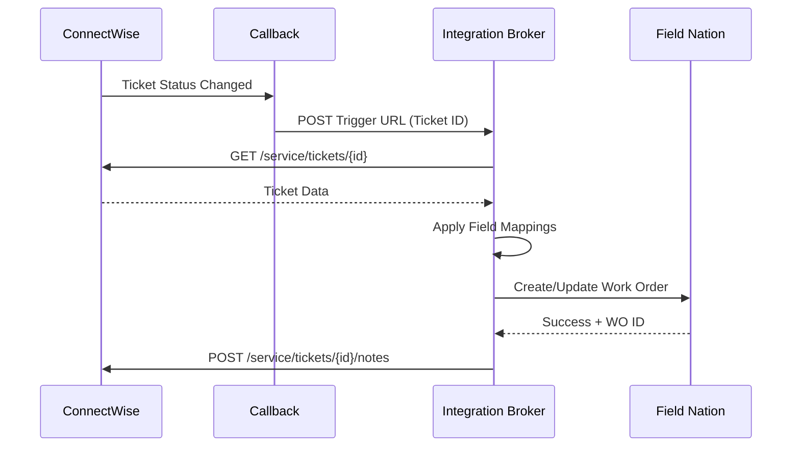

## Overview

The ConnectWise connector enables seamless integration between ConnectWise Manage and Field Nation:
- **Service ticket dispatch**: Automatically create work orders from ConnectWise Service Tickets
- **REST API integration**: Modern API with member impersonation
- **Callback-based triggers**: Real-time notifications via callbacks
- **Bidirectional sync**: Status and notes flow both directions
- **Custom fields support**: Map ConnectWise custom fields

---

## At a Glance

<Cards>
  <Card title="Authentication" icon="Lock">
    API Keys (Company ID + Public/Private Key + Member ID)
  </Card>
  <Card title="Supported Objects" icon="Database">
    Service Tickets, Project Tickets, Opportunities
  </Card>
  <Card title="Trigger Mechanism" icon="Zap">
    Callbacks (webhooks) + API polling
  </Card>
  <Card title="Data Flow" icon="ArrowLeftRight">
    Bidirectional (create, update, notes)
  </Card>
</Cards>

---

## How It Works

<Steps>

### Configure Callback

Set up callback in ConnectWise that triggers on ticket status changes

### Callback Notification

ConnectWise sends ticket ID to Field Nation when conditions met

### Field Nation Fetches Data

Integration Broker retrieves complete ticket data from ConnectWise REST API

### Apply Mappings

Broker transforms ConnectWise data into Field Nation work order format

### Create Work Order

Work order created with correlation ID stored for bidirectional sync

</Steps>

---

## Common Use Cases

### Dispatch from Service Ticket

Automatically create Field Nation work order when Service Ticket requires on-site technician

```
Service Ticket Status = "Dispatch"
AND Board = "Field Services"
  → Callback triggers
  → Field Nation Work Order Created
```

### Project-Based Dispatch

Create work orders from ConnectWise Project tickets

```
Project Ticket Type = "On-Site"
AND Status = "Scheduled"
  → Work order created
  → Project ticket updated
```

### Status Synchronization

Reflect Field Nation completion back to ConnectWise

```
FN Work Order = "Completed"
  → Integration Broker
  → CW Ticket Status = "Completed"
  → Internal Note added
```

---

## Architecture



---

## Features

### Field Mapping Capabilities

- **Standard Fields**: Summary, Initial Description, Status, Priority, Date Resolved
- **Custom Fields**: Access any custom field on Service Ticket
- **Related Objects**: Company, Contact, Member (resource), Board
- **Service Location**: Site address information
- **Time Entries**: Integration with ConnectWise time tracking

### Supported Operations

<TypeTable
  type={{
    "Work Order Creation": {
      type: "Inbound",
      description: "Create FN work order from CW Service Ticket via callback"
    },
    "Work Order Update": {
      type: "Inbound",
      description: "Update existing FN work order when CW ticket changes"
    },
    "Status Synchronization": {
      type: "Outbound",
      description: "Update CW ticket when FN work order status changes"
    },
    "Notes Sync": {
      type: "Bidirectional",
      description: "Sync comments via Service Notes"
    }
  }}
/>

---

## Prerequisites

### ConnectWise Requirements

<Accordions type="multiple">
  <Accordion title="API Access">
    - ConnectWise Manage license with API access
    - Admin or API-enabled member account
    - API keys generated (Public + Private)
    - Member impersonation configured
  </Accordion>
  
  <Accordion title="API Keys">
    Generate in ConnectWise:
    1. System → Members → Select API member
    2. API Keys tab → Generate New Keys
    3. Copy Company ID, Public Key, Private Key
    4. Note Member ID for impersonation
  </Accordion>
  
  <Accordion title="Callback Configuration">
    - Ability to configure ConnectWise callbacks
    - Callback endpoint URL from Field Nation
    - Network access to send callbacks
    - Optional: IP whitelisting for Field Nation
  </Accordion>
  
  <Accordion title="Entity Access">
    API member must have:
    - Read access to Service Tickets and all fields
    - Write access for status/note updates
    - Access to related objects (Company, Contact, Site)
    - Permission to view custom fields
  </Accordion>
</Accordions>

### Field Nation Requirements

- Active buyer account with admin access
- Integration settings access
- Sandbox environment (recommended for testing)

[Complete prerequisites →](/docs/connectors/getting-started)

---

## Authentication

ConnectWise connector uses **API Key Authentication** with member impersonation:

```
Company ID: {company_id}
Public Key: {public_key}
Private Key: {private_key}
Member ID: {member_id}
Client ID: Field Nation Integration
```

**Components:**
- **Company ID**: Your ConnectWise company identifier
- **Public Key**: API public key (generated)
- **Private Key**: API private key (generated, keep secure)
- **Member ID**: API member's ID for impersonation
- **Client ID**: Integration identifier (optional)

**Authentication Header Format:**
```
Authorization: Basic base64(CompanyID+PublicKey+PrivateKey:MemberID)
Client-Id: FieldNationIntegration
```

<Callout type="warn">
**Security Best Practice**: Use dedicated API member (not personal account). Store Private Key securely - it's equivalent to a password.
</Callout>

---

## Data Flow Patterns

### Inbound: ConnectWise → Field Nation

**Trigger**: Callback fired on ticket status/board change  
**Action**: Callback sends Ticket ID to Field Nation  
**Result**: Field Nation work order created/updated

**Example Callback Triggers:**
- Ticket Status changed to "Dispatch"
- Board changed to "Field Services"
- Custom field "Send to FN" = true
- Priority set to "Priority 1"

---

### Outbound: Field Nation → ConnectWise

**Trigger**: Field Nation work order event  
**Action**: Integration Broker calls ConnectWise REST API  
**Result**: ConnectWise ticket updated with status/notes

**Configurable Events:**
- Work order assigned → Update ticket status
- Work order completed → Add internal note
- Provider checked in → Update custom field
- Work order approved → Update status to "Completed"

---

## Best Practices

### Callback Design

- ✅ Use specific status/board values
- ✅ Configure for relevant ticket types only
- ✅ Add safeguards to prevent duplicates
- ✅ Test in staging ConnectWise instance
- ✅ Monitor callback delivery logs

### Field Mappings

- ✅ Map all required Field Nation fields
- ✅ Use custom fields for additional data
- ✅ Handle ConnectWise status boards correctly
- ✅ Test service location address mapping
- ✅ Document custom field IDs

### Security

- ✅ Use dedicated API member
- ✅ Rotate API keys annually
- ✅ Grant minimum required permissions
- ✅ Monitor API usage in ConnectWise
- ✅ Enable IP whitelisting if required

---

## Limitations & Considerations

### API Limits

ConnectWise enforces rate limits:
- Typically 1,000 requests per 5 minutes
- Monitor via System → API Usage

Each work order sync consumes **2-3 API calls**.

### REST API Versioning

- ConnectWise API versions periodically
- Test after ConnectWise upgrades
- Review release notes for breaking changes

### Related Object Depth

Can access:
- ✅ Fields on Service Ticket
- ✅ Fields from Company, Contact, Board, Site
- ❌ Deep nested relationships (custom JSONNET needed)

---
