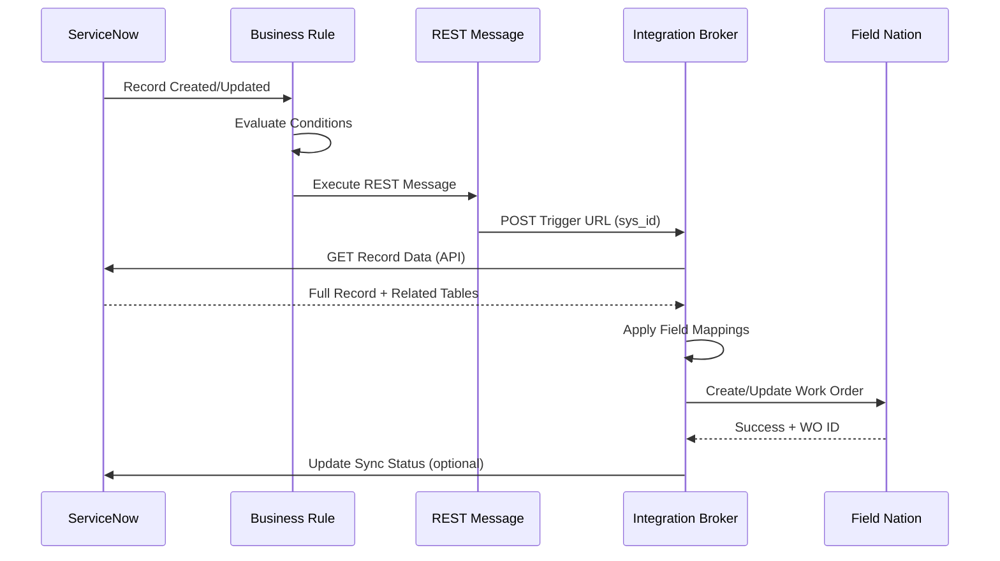

## Overview

The ServiceNow connector enables seamless integration between ServiceNow ITSM and Field Nation:
- **Trigger-based creation**: Use Business Rules to automatically create work orders
- **REST Message integration**: Secure webhook communication
- **Bidirectional sync**: Status and notes flow both directions
- **Flexible table support**: Works with Incident, Case, or custom tables
- **Related field access**: Map fields from related tables

---

## At a Glance

<Cards>
  <Card title="Authentication" icon="Lock">
    OAuth 2.0 or Basic Auth (username + password)
  </Card>
  <Card title="Supported Tables" icon="Database">
    Incident, Case, Problem, or custom tables
  </Card>
  <Card title="Trigger Mechanism" icon="Zap">
    Business Rules + REST Messages
  </Card>
  <Card title="Data Flow" icon="ArrowLeftRight">
    Bidirectional (create, update, messages)
  </Card>
</Cards>

---

## How It Works

<Steps>

### Configure Business Rule

Create Business Rule in ServiceNow that evaluates conditions (state change, assignment, etc.)

### Call REST Message

Business Rule invokes REST Message to send record sys_id to Field Nation trigger URL

### Field Nation Fetches Data

Integration Broker retrieves complete record data from ServiceNow API using configured credentials

### Apply Mappings

Broker applies field mappings and transformations to convert ServiceNow data into Field Nation work order format

### Create Work Order

Transformed data creates or updates Field Nation work order with correlation ID stored for bidirectional sync

</Steps>

---

## Common Use Cases

### Dispatch from Incident

Automatically create Field Nation work order when Incident requires on-site service

```
Incident State = "On-Site Required" 
  → Business Rule triggers 
  → REST Message 
  → Field Nation Work Order Created
```

### Assignment-Based Triggering

Dispatch when incident assigned to field service group

```
Assignment Group = "Field Services"
  → Business Rule triggers
  → Work order created
  → Assignment updated with FN details
```

### Status Synchronization

Reflect Field Nation work order status back to ServiceNow Incident

```
FN Work Order Status = "Completed"
  → Integration Broker
  → ServiceNow Incident State = "Resolved"
  → Work Notes added with completion details
```

---

## Architecture



---

## Features

### Field Mapping Capabilities

- **Standard Fields**: Short Description, Description, State, Priority
- **Custom Fields**: Access any custom field on base table
- **Related Tables**: Map fields from Assignment Group, Location, Caller, etc.
- **Reference Fields**: Access related record data (e.g., Location.Name)
- **Choice Fields**: Map ServiceNow choices to Field Nation enums

### Supported Operations

<TypeTable
  type={{
    "Work Order Creation": {
      type: "Inbound",
      description: "Create FN work order from ServiceNow record via Business Rule"
    },
    "Work Order Update": {
      type: "Inbound",
      description: "Update existing FN work order when ServiceNow record changes"
    },
    "Status Synchronization": {
      type: "Outbound",
      description: "Update ServiceNow record when FN work order status changes"
    },
    "Work Notes Sync": {
      type: "Bidirectional",
      description: "Sync comments via Work Notes or Journal fields"
    }
  }}
/>

---

## Prerequisites

### ServiceNow Requirements

<Accordions type="multiple">
  <Accordion title="Admin Access">
    - Create and modify Business Rules
    - Configure REST Messages
    - Manage integration users and roles
    - Access Studio or Update Sets
  </Accordion>
  
  <Accordion title="API Enabled User">
    - ServiceNow user with web_service_admin or rest_api_explorer role
    - Read permissions on all fields to sync FROM ServiceNow
    - Write permissions on all fields to sync TO ServiceNow
    - Access to base table and related tables
  </Accordion>
  
  <Accordion title="Network Access">
    - Allow REST API access (not blocked by ACLs)
    - Whitelist Field Nation IP addresses if using IP restrictions
    - Enable "web_service_provider" plugin (usually enabled)
  </Accordion>
</Accordions>

### Field Nation Requirements

- Active buyer account with admin access
- Integration settings access
- Sandbox environment (recommended for testing)

[Complete prerequisites →](/docs/connectors/getting-started)

---

## Authentication

ServiceNow connector supports **OAuth 2.0** (recommended) or **Basic Auth**:

### OAuth 2.0 (Recommended)

```
Grant Type: Client Credentials
Token Endpoint: https://instance.service-now.com/oauth_token.do
Client ID: {your_client_id}
Client Secret: {your_client_secret}
```

**Benefits:**
- More secure (no password storage)
- Token rotation automatic
- Better audit trails
- Granular scope control

### Basic Authentication

```
Username: integration.user
Password: {secure_password}
Format: Basic base64(username:password)
```

**When to Use:**
- Quick setup for testing
- Legacy ServiceNow instances
- Simpler credential management

<Callout type="warn">
**Security Best Practice**: Use OAuth 2.0 in production. Create dedicated integration user instead of personal account for better security and audit trails.
</Callout>

---

## Data Flow Patterns

### Inbound: ServiceNow → Field Nation

**Trigger**: Business Rule evaluates conditions  
**Action**: REST Message sends sys_id to Field Nation  
**Result**: Field Nation work order created/updated

**Example Business Rule Conditions:**
- State = "On-Site Required"
- Custom Field "Dispatch to FN" = true
- Priority = "1-Critical" AND Category = "Hardware"
- Assignment Group contains "Field"

---

### Outbound: Field Nation → ServiceNow

**Trigger**: Field Nation work order event (assigned, completed, etc.)  
**Action**: Integration Broker calls ServiceNow API  
**Result**: ServiceNow Incident/record updated with status/work notes

**Configurable Events:**
- Work order assigned → Update Incident State
- Work order completed → Add Work Notes with details
- Provider checked in → Update custom field "Tech Arrived"
- Work order approved → Update State to "Resolved"

---

## Best Practices

### Business Rule Design

- ✅ Use specific conditions (avoid "on any field update")
- ✅ Run Business Rule "async" to prevent blocking
- ✅ Add condition to prevent duplicate triggers
- ✅ Test in sub-production instance first
- ✅ Document Business Rule logic

### Field Mappings

- ✅ Map all required Field Nation fields
- ✅ Use default values for optional fields
- ✅ Handle Choice fields with Array Map
- ✅ Test with various record states
- ✅ Document mapping logic

### Security

- ✅ Use OAuth 2.0 in production
- ✅ Use dedicated integration user
- ✅ Grant minimum required roles
- ✅ Monitor API usage and limits
- ✅ Enable IP whitelisting if policy requires

---

## Limitations & Considerations

### API Limits

ServiceNow enforces API call limits based on license:
- **Enterprise**: Varies by contract
- **Professional**: Limited API calls/hour
- **Developer instances**: 10K calls/24 hours

Each work order sync consumes **2-3 API calls** (authentication + data retrieval + optional status update).

[Monitor API usage in ServiceNow → System Diagnostics → Stats]

### Related Table Depth

The connector can access:
- ✅ Fields on base table (Incident, Case, etc.)
- ✅ Fields on directly related tables (Assignment Group, Location, Caller)
- ❌ Grand-parent or distant relationships (requires custom JSONNET)

**Example Access:**
- ✅ `incident.location.name` - Direct reference
- ✅ `incident.caller_id.email` - Direct relationship
- ❌ `incident.location.parent.company.name` - Multiple levels (not automatic)

---
