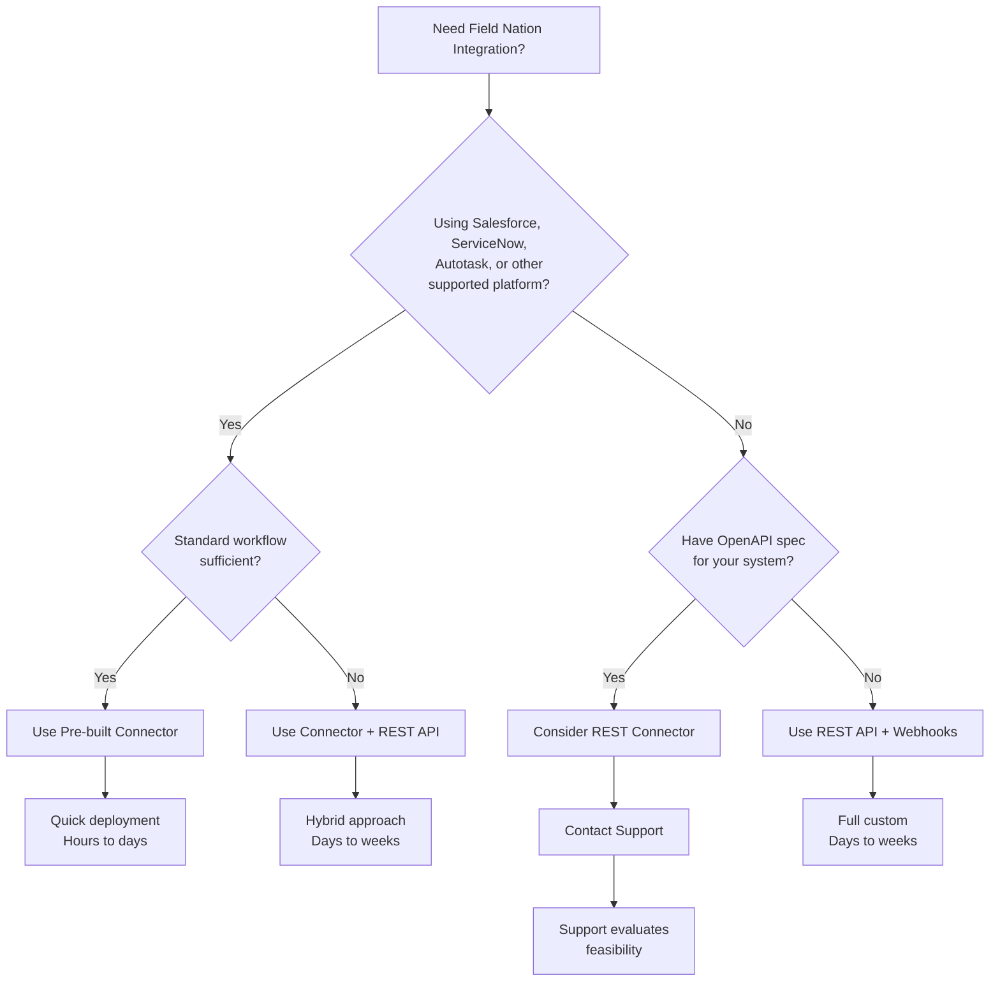

## Quick Comparison

<Tabs items={["REST API + Webhooks", "Pre-built Connectors"]}>
  <Tab value="REST API + Webhooks">
    ### Code-Based Integration

    **Best for:** Custom integrations, unique workflows, maximum control

    **What you build:**
    - REST API calls to create/manage work orders (inbound)
    - Webhook listeners to receive events (outbound)
    - Custom business logic and transformations

    **Requirements:**
    - Developer resources
    - Programming knowledge (any language)
    - OAuth 2.0 implementation
    - HTTPS webhook endpoint

    **Time to deploy:** Days to weeks (depending on complexity)

    **Flexibility:** ⭐⭐⭐⭐⭐ Complete control
  </Tab>

  <Tab value="Pre-built Connectors">
    ### No-Code Integration

    **Best for:** Standard workflows, ERP/CRM/PSA platforms, quick deployment

    **What you get:**
    - Out-of-the-box integration
    - Pre-configured field mappings
    - Managed authentication
    - Built-in error handling

    **Requirements:**
    - Supported platform (Salesforce, ServiceNow, etc.)
    - Platform admin access
    - Field Nation integration contract

    **Time to deploy:** Hours to days

    **Flexibility:** ⭐⭐⭐ Configurable within connector capabilities
  </Tab>
</Tabs>

---

## Integration Architecture

Understanding how data flows through Field Nation helps you choose the right approach:

  
  

### How the Architecture Works

The diagram illustrates three integration paths to Field Nation's core platform:

**Code-Based Integration (Bottom Layer):**
- **Client API** - Direct REST API calls from your system to create/manage work orders
- **Webhooks** - Event notifications from Field Nation to your system
- **Your Responsibility:** Authentication, data transformation, error handling, retry logic

**Connector Integration (Top Layer):**
- **OOB Connectors** - Pre-built integrations for Salesforce, ServiceNow, Autotask, etc.
- **REST Connector** - Generic connector for systems with OpenAPI specifications
- **Broker Layer** - Field Nation middleware that handles authentication, mapping, queuing, and retries
- **Managed Service:** Field Nation handles complexity

**Core Platform:**
- **FN-CORE** - Where all work orders, providers, schedules, and data reside
- All integration paths ultimately communicate with FN-CORE
- Client API serves as the gateway layer

---

## Detailed Comparison

| Factor | REST API + Webhooks | Pre-built Connectors |
|--------|---------------------|---------------------|
| **Setup Complexity** | Moderate to High | Low |
| **Developer Required** | Yes | No |
| **Customization** | Unlimited | Limited to connector features |
| **Maintenance** | Your responsibility | Managed by Field Nation |
| **Supported Platforms** | Any system | 9 platforms + REST Connector |
| **Cost** | Development time | Integration contract |
| **API Endpoints** | 150+ endpoints | Connector-specific |
| **Webhook Events** | 33 events | Automatic event mapping |
| **Best Use Case** | Custom apps, unique workflows | Standard ERP/CRM/PSA workflows |

---

## Code-Based Integration

The combination of **REST API + Webhooks** provides powerful and flexible integration capabilities.

### How It Works

<Steps>
  <Step>
    ### Inbound: REST API

    Use the REST API to **push data to Field Nation**:
    - Create work orders from your system
    - Update work order details
    - Manage provider assignments
    - Handle tasks and deliverables

    **Example:** When a ticket is created in your system, call the REST API to create a corresponding Field Nation work order.
  </Step>

  <Step>
    ### Outbound: Webhooks

    Configure webhooks to **receive events from Field Nation**:
    - Work order status changes
    - Provider assignments
    - Task completions
    - Deliverable uploads

    **Example:** When a provider completes work, Field Nation sends a webhook to your endpoint, triggering ticket closure in your system.
  </Step>
</Steps>

### Current Webhook Events

We currently support **33 events** across work order lifecycle, assignments, tasks, and status changes. This covers essential integration scenarios:

- Work order creation, updates, deletions
- Status transitions (assigned, work done, approved, paid)
- Provider actions (checked in, checked out, uploads)
- Task completions
- Schedule updates
- Custom field changes

<Callout type="info">
  While 33 events cover core workflows, we're continuously expanding event coverage. Check the [Webhooks Events Catalog](/docs/webhooks/concepts/events) for the complete list.
</Callout>

### When to Choose REST API + Webhooks

✅ **Choose this approach if:**

- You're building a custom application
- Your system isn't a supported connector platform
- You need unique workflow logic
- You want full control over integration behavior
- You have developer resources available
- You need to integrate with multiple Field Nation features

### Getting Started with Code-Based

1. Review [Prerequisites](/docs/getting-started/prerequisites)
2.- **Start with**: [REST API Quickstart](/docs/rest-api/v2/quickstart)
- **Use when**: You need full control and have improved developer resources.
3. Set up [Webhooks](/docs/webhooks/quickstart)
4. Explore [REST API Introduction](/docs/rest-api/introduction) for all capabilities

---

## No-Code Integration (Connectors)

Pre-built connectors provide **turnkey integrations** with leading platforms, requiring minimal to no coding.

### Supported Platforms

<Cards>
  <Card
    href="/docs/connectors/platforms/salesforce/overview"
    title="Salesforce"
    description="CRM and Service Cloud integration"
  />
  <Card
    href="/docs/connectors/platforms/servicenow/overview"
    title="ServiceNow"
    description="ITSM incident and request management"
  />
  <Card
    href="/docs/connectors/platforms/autotask/overview"
    title="Autotask"
    description="Datto PSA integration"
  />
  <Card
    href="/docs/connectors/platforms/connectwise/overview"
    title="ConnectWise"
    description="PSA service ticket management"
  />
  <Card
    href="/docs/connectors/platforms/freshdesk/overview"
    title="Freshdesk"
    description="Customer support ticketing"
  />
  <Card
    href="/docs/connectors/platforms/netsuite/overview"
    title="NetSuite"
    description="ERP system integration"
  />
  <Card
    href="/docs/connectors/platforms/quickbase/overview"
    title="Quickbase"
    description="Low-code application platform"
  />
  <Card
    href="/docs/connectors/platforms/smartsheet/overview"
    title="Smartsheet"
    description="Project management and sheets"
  />
</Cards>

### Special: REST Connector

The **REST Connector** is a unique offering that can connect to **almost any system** with an OpenAPI specification.

**How it works:**
1. You provide your system's OpenAPI spec
2. Field Nation uses it to configure field mappings
3. Authentication is set up using your system's credentials
4. The connector manages bidirectional synchronization

**Limitations:**
- Some advanced features may not be available
- Requires your system to have an OpenAPI spec
- Field mapping is based on spec definitions

<Callout type="warn" title="Contact Support Required">
  The REST Connector requires Field Nation configuration. [Submit a support case](https://app.fieldnation.com/support-cases) to discuss your specific system and requirements.
</Callout>

### When to Choose Connectors

✅ **Choose connectors if:**

- You use a supported platform (Salesforce, ServiceNow, etc.)
- You want quick deployment (hours, not weeks)
- You prefer no-code/low-code solutions
- You have standard field service workflows
- You want Field Nation to manage integration maintenance

### Getting Started with Connectors

1. Review [Connector Overview](/docs/connectors/introduction)
2. Find your platform in [Supported Platforms](/docs/connectors/introduction)
3. Follow platform-specific setup guides
4. For REST Connector: [Contact Support](https://app.fieldnation.com/support-cases)

---

## Can I Use Both?

**Yes!** Many customers combine approaches:

- **Connectors for standard workflows** (e.g., Salesforce ticket → Field Nation work order)
- **REST API for custom features** (e.g., advanced reporting, custom dashboards)
- **Webhooks for real-time notifications** (e.g., mobile app notifications)

This hybrid approach gives you the speed of connectors with the flexibility of custom code where needed.

---

## Decision Tree

Use this flowchart to determine your approach:

---

## Getting Help

### For Code-Based Integration

- **Documentation:**
  - [REST API](/docs/rest-api/v2/introduction) - Programmatic access to data and operations
  - [Webhooks](/docs/webhooks/v3/introduction) - Real-time event notifications
  - [Connectors](/docs/connectors/introduction) - Pre-built integrations for specific platforms
- **Support Portal:** [Submit a case](https://app.fieldnation.com/support-cases) for technical questions
- **Sales Team:** Contact your Field Nation representative

### For Connector Integration

- **Connector Docs:** [Browse platforms](/docs/connectors/introduction)
- **Support Portal:** [Submit a case](https://app.fieldnation.com/support-cases) to request connector access
- **Integration Team:** Dedicated support during setup

### General Resources

- **Marketing Site:** Learn about [Field Nation Integrations](https://fieldnation.com/field-nation-integrations?cta=main_nav)
- **Support Portal:** [Submit technical questions](https://app.fieldnation.com/support-cases)
- **Sales:** Contact your Field Nation representative

<Callout type="info" title="Already a Customer?">
  If you already have a Field Nation account, visit the [Support Portal](https://app.fieldnation.com/support-cases) to submit a case for integration access, technical questions, or connector setup assistance.
</Callout>

---
