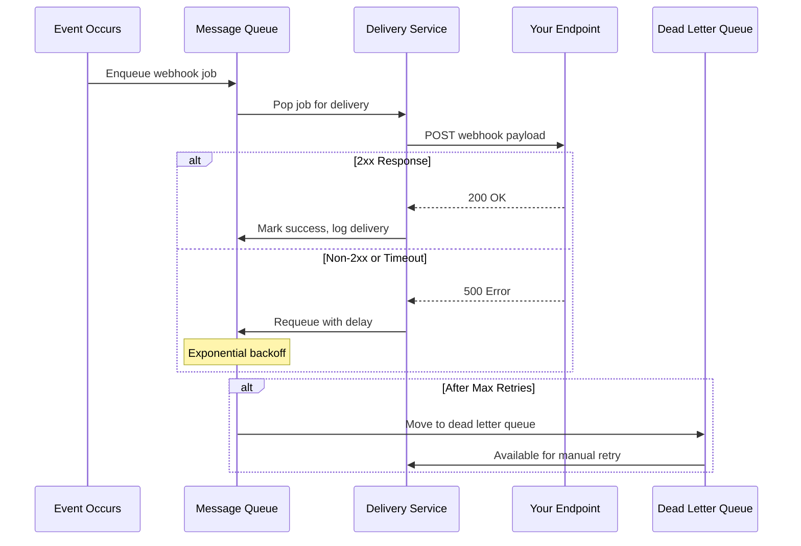
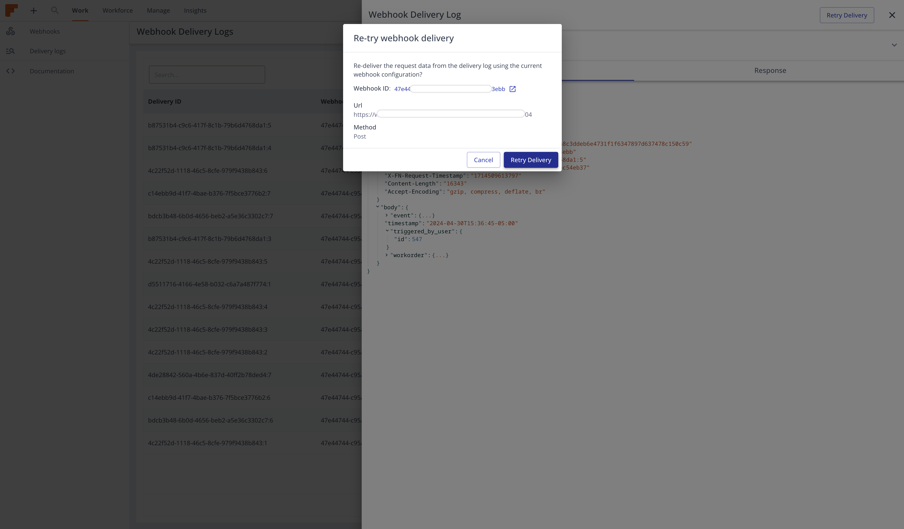

## Delivery Flow



---

## Delivery Lifecycle

<Steps>

### Event Triggered

When an event occurs in Field Nation (e.g., work order published), the system identifies all webhooks subscribed to that event.

### Job Creation

For each subscribed webhook, a delivery job is created and added to the message queue with:
- Webhook configuration
- Event payload
- Delivery metadata
- Retry counter (starts at 0)

### Immediate Delivery Attempt

The delivery service picks up the job and sends an HTTP POST/PUT request to your endpoint:

```http
POST /webhooks/fieldnation HTTP/1.1
Host: your-endpoint.com
Content-Type: application/json
x-fn-signature: sha256=abc123...
x-fn-webhook-id: wh_abc123
x-fn-event-name: workorder.created
x-fn-delivery-id: del_xyz789
x-fn-timestamp: 2025-01-15T10:30:00Z

{webhook payload}
```

### Response Evaluation

Your endpoint's response determines the next step:

| Response | Action |
|----------|--------|
| **2xx (Success)** | Mark delivery successful, log, done |
| **404, 410** | Hard failure, skip retries, log error |
| **Other 4xx** | Client error, skip retries, log error |
| **5xx** | Server error, schedule retry with backoff |
| **Timeout (30s)** | Network issue, schedule retry |
| **Connection Error** | Network issue, schedule retry |

### Retry or Complete

- **Success (2xx)**: Job complete, delivery logged
- **Hard failure (404/410)**: Job failed permanently, no retry
- **Retriable error**: Job requeued with exponential delay

</Steps>

---

## Retry Strategy

Field Nation uses **exponential backoff** to retry failed deliveries, giving your system time to recover from temporary issues.

### Retry Schedule

| Attempt | Delay After Previous | Total Time Elapsed | Notes |
|---------|---------------------|-------------------|-------|
| 1 (Initial) | 0 seconds | 0 sec | Immediate |
| 2 | 10 seconds | 10 sec | - |
| 3 | 20 seconds | 30 sec | - |
| 4 | 40 seconds | 1 min 10 sec | - |
| 5 | 80 seconds | 2 min 30 sec | - |
| 6 | 160 seconds | 5 min 10 sec | - |
| 7 | 320 seconds | 10 min 30 sec | - |
| 8 | 640 seconds | 21 min 10 sec | Final attempt |

### Dynamic Retry Count

The maximum retry attempts are **dynamic** based on your webhook's success rate:

- **High success rate (>95%)**: Up to 7 retries
- **Medium success rate (80-95%)**: Up to 5 retries
- **Low success rate (&lt;80%)**: Minimum 3 retries

This adaptive approach:
- ✅ Rewards reliable endpoints with more retry attempts
- ⚠️ Reduces load on consistently failing endpoints
- 🎯 Optimizes resource usage

<Callout type="info">
**Initial Setup**: New webhooks start with 7 retry attempts. Success rate is calculated after ~100 deliveries.
</Callout>

### Backoff Formula

Each retry doubles the previous delay:

```javascript
function calculateDelay(attemptNumber) {
  const baseDelay = 10; // seconds
  return baseDelay * Math.pow(2, attemptNumber - 2);
}

// Attempt 2: 10 * 2^0 = 10 seconds
// Attempt 3: 10 * 2^1 = 20 seconds
// Attempt 4: 10 * 2^2 = 40 seconds
// ...
```

---

## Hard Failures (No Retry)

Certain errors indicate permanent problems and skip retries entirely:

### 404 Not Found

```http
HTTP/1.1 404 Not Found
```

**Meaning**: Your endpoint doesn't exist or path is incorrect

**Action**: No retry, delivery marked as permanently failed

**Fix**: Update webhook URL configuration

---

### 410 Gone

```http
HTTP/1.1 410 Gone
```

**Meaning**: Endpoint permanently removed

**Action**: No retry, delivery marked as permanently failed

**Fix**: Delete webhook or update URL

---

## Message Queue Architecture

Field Nation uses Redis-based queuing with multiple priority levels:

### Queue Priority

1. **High Priority**: Critical events (payment, approval)
2. **Normal Priority**: Standard events (status changes)
3. **Low Priority**: Non-critical events (messages, uploads)

### Queue Management

```plaintext
┌─────────────────┐
│  Event Occurs   │
└────────┬────────┘
         │
         ▼
┌─────────────────┐
│  Create Job     │
│  - Payload      │
│  - Retry: 0     │
│  - Priority     │
└────────┬────────┘
         │
         ▼
┌─────────────────┐
│  Message Queue  │
│  (Redis)        │
└────────┬────────┘
         │
         ▼
┌─────────────────┐
│ Delivery Worker │
│ Pick & Deliver  │
└────────┬────────┘
         │
    ┌────┴────┐
    │         │
    ▼         ▼
  Success   Failure
    │         │
    │         ▼
    │    ┌─────────┐
    │    │ Requeue │
    │    │ + Delay │
    │    └────┬────┘
    │         │
    │    Max retries?
    │         │
    │    ┌────┴────┐
    │    │   Yes   │   No
    │    ▼         ▼
    │   DLQ    Retry Queue
    │    │
    └────┴─> Delivery Log
```

### Worker Pool

- **Multiple workers**: Parallel delivery processing
- **Rate limiting**: Prevents overwhelming your endpoint
- **Timeout handling**: 30-second max per request

---

## Dead Letter Queue (DLQ)

After exhausting all retries, failed deliveries move to the Dead Letter Queue for manual intervention.

### What Goes to DLQ?

- Deliveries that failed all retry attempts
- Events that repeatedly timeout
- Persistent 5xx errors from your endpoint

### Manual Retry

You can manually retry deliveries via API or UI:

**Via API:**

```bash
curl -X PATCH https://api-sandbox.fndev.net/api/v1/webhooks/delivery-logs/del_xyz789/retry \
  -H "Authorization: Bearer YOUR_ACCESS_TOKEN"
```

**Response:**

```json
{
  "metadata": {
    "timestamp": "2025-01-15T11:00:00Z"
  },
  "result": {
    "job_id": "job_abc123"
  }
}
```

**Via UI:**



This creates a new delivery job that you can track in delivery logs.

---

## Automatic Deactivation

To prevent infinite failed delivery attempts, webhooks are automatically deactivated under certain conditions:

### Deactivation Policy

- **Trigger**: 7 consecutive days of failed deliveries
- **Action**: Webhook status changes from `active` to `inactive`
- **Notification**: Email sent to `notificationEmail` (if configured)

### What Happens When Deactivated?

- ❌ No new delivery attempts
- ❌ Events are not queued
- ✅ Webhook configuration preserved
- ✅ Historical delivery logs remain accessible

### Reactivation

Update webhook status to `active` after fixing endpoint issues:

```bash
curl -X PUT https://api-sandbox.fndev.net/api/v1/webhooks/wh_abc123 \
  -H "Authorization: Bearer YOUR_ACCESS_TOKEN" \
  -H "Content-Type: application/json" \
  -d '{
    "status": "active"
  }'
```

<Callout type="warn">
**Important**: Fix the underlying issues before reactivating. Repeated deactivations may result in permanent suspension.
</Callout>

---

## Delivery Logging

Every delivery attempt is logged with complete details:

### Log Contents

```json
{
  "deliveryId": "del_xyz789",
  "webhookId": "wh_abc123",
  "workOrderId": 12345,
  "eventName": "workorder.status.published",
  "deliveryStatus": 200,
  "deliveryAttempt": 1,
  "requestUrl": "https://your-endpoint.com/webhooks",
  "requestMethod": "POST",
  "requestHeaders": {
    "content-type": "application/json",
    "x-fn-signature": "sha256=...",
    "x-fn-webhook-id": "wh_abc123"
  },
  "requestBody": "{...full payload...}",
  "responseStatus": 200,
  "responseHeaders": {
    "content-type": "text/plain"
  },
  "responseBody": "OK",
  "responseTime": 145,
  "createdAt": "2025-01-15T10:30:00Z"
}
```

### Accessing Logs

Via API:

```bash
# List delivery logs
curl -X GET "https://api-sandbox.fndev.net/api/v1/webhooks/delivery-logs?webhookId=wh_abc123" \
  -H "Authorization: Bearer YOUR_ACCESS_TOKEN"

# Get specific delivery details
curl -X GET https://api-sandbox.fndev.net/api/v1/webhooks/delivery-logs/del_xyz789 \
  -H "Authorization: Bearer YOUR_ACCESS_TOKEN"
```

Via UI:
- Navigate to [Webhooks Dashboard](https://ui-sandbox.fndev.net/integrations/webhooks)
- Select your webhook
- Click "Delivery Logs" tab


[Learn more about monitoring →](/docs/webhooks/guides/monitoring)

---

## Delivery Best Practices

### Respond Quickly (< 5 seconds)

```javascript
app.post('/webhooks', async (req, res) => {
  // Acknowledge immediately
  res.status(200).send('OK');
  
  // Process asynchronously
  processWebhookAsync(req.body)
    .catch(error => {
      console.error('Async processing error:', error);
      // Log error, but response already sent
    });
});
```

### Implement Idempotency

Handle duplicate deliveries gracefully:

```javascript
async function processWebhook(payload) {
  const { eventId } = payload;
  
  // Check if already processed
  const processed = await redis.exists(`event:${eventId}`);
  if (processed) {
    console.log(`Already processed: ${eventId}`);
    return;
  }
  
  // Process the event
  await handleEvent(payload);
  
  // Mark as processed (TTL: 7 days)
  await redis.setex(`event:${eventId}`, 604800, 'true');
}
```

### Return Appropriate Status Codes

```javascript
app.post('/webhooks', async (req, res) => {
  try {
    // Verify signature
    if (!verifySignature(req.body, req.headers['x-fn-signature'])) {
      return res.status(401).send('Invalid signature');
    }
    
    // Acknowledge success
    return res.status(200).send('OK');
    
  } catch (error) {
    if (error.code === 'VALIDATION_ERROR') {
      // Client error, no retry needed
      return res.status(400).send('Invalid payload');
    }
    
    // Server error, retry appropriate
    console.error('Processing error:', error);
    return res.status(500).send('Internal error');
  }
});
```

### Handle Network Issues

```javascript
// Implement circuit breaker for downstream services
const circuitBreaker = new CircuitBreaker(async (payload) => {
  await syncToSalesforce(payload.data);
}, {
  timeout: 3000,           // 3 second timeout
  errorThresholdPercentage: 50,
  resetTimeout: 30000      // Try again after 30 seconds
});

async function processWebhookAsync(payload) {
  try {
    await circuitBreaker.fire(payload);
  } catch (error) {
    // Log error, webhook already acknowledged
    await logFailedProcessing(payload.eventId, error);
  }
}
```

### Monitor Delivery Health

Set up alerts for:

- High failure rate (>5%)
- Increased retry attempts
- Slow response times (>2 seconds)
- Webhook deactivation

```javascript
// Example CloudWatch metric
await cloudwatch.putMetricData({
  Namespace: 'Webhooks',
  MetricData: [{
    MetricName: 'DeliveryFailures',
    Value: failureCount,
    Unit: 'Count',
    Timestamp: new Date()
  }]
});
```

---

## Delivery Guarantees

### At-Least-Once Delivery

Field Nation guarantees **at-least-once delivery**:

- ✅ Every event will be delivered at least once
- ⚠️ Events may be delivered more than once
- 🎯 Implement idempotency to handle duplicates

### Ordering

Events are delivered **approximately** in order, but strict ordering is not guaranteed:

- Events from the same work order usually arrive in sequence
- Network latency and retries can cause reordering
- Don't rely on event order for critical logic

### Example Handling Order-Sensitive Events

```javascript
async function processWorkOrderEvent(payload) {
  const { workOrderId, timestamp, data } = payload;
  
  // Fetch current work order state
  const currentState = await getWorkOrder(workOrderId);
  
  // Check if event is stale (older than current state)
  if (new Date(timestamp) < new Date(currentState.updatedAt)) {
    console.log(`Stale event ignored: ${payload.eventId}`);
    return;
  }
  
  // Process the event
  await updateWorkOrder(workOrderId, data);
}
```

---

## Troubleshooting Delivery Issues

### Deliveries Not Arriving?

<Accordions type="multiple">
  <Accordion title="Check webhook status">
    Ensure webhook is `active`:
    
    ```bash
    curl -X GET https://api-sandbox.fndev.net/api/v1/webhooks/wh_abc123 \
      -H "Authorization: Bearer YOUR_ACCESS_TOKEN"
    ```
  </Accordion>
  <Accordion title="Verify endpoint accessibility">
    Test publicly accessible:
    
    ```bash
    curl -X POST https://your-endpoint.com/webhooks \
      -H "Content-Type: application/json" \
      -d '{"test": "data"}'
    ```
  </Accordion>
  <Accordion title="Review delivery logs">
    Check for error patterns:
    
    ```bash
    curl -X GET "https://api-sandbox.fndev.net/api/v1/webhooks/delivery-logs?deliveryStatus=500" \
      -H "Authorization: Bearer YOUR_ACCESS_TOKEN"
    ```
  </Accordion>
  <Accordion title="Check SSL certificate">
    Ensure valid HTTPS certificate:
    
    ```bash
    curl -v https://your-endpoint.com
    ```
    
    Look for SSL verification errors.
  </Accordion>
</Accordions>

### Common Delivery Errors

| Error | Cause | Solution |
|-------|-------|----------|
| **Connection timeout** | Endpoint slow to respond | Optimize response time, use async processing |
| **SSL certificate error** | Invalid/expired certificate | Renew SSL certificate |
| **DNS resolution failed** | Domain doesn't resolve | Check DNS configuration |
| **Connection refused** | Server not listening on port | Verify server is running, check firewall |
| **502 Bad Gateway** | Reverse proxy misconfiguration | Check nginx/load balancer config |

[Complete troubleshooting guide →](/docs/webhooks/troubleshooting/delivery-failures)

---
