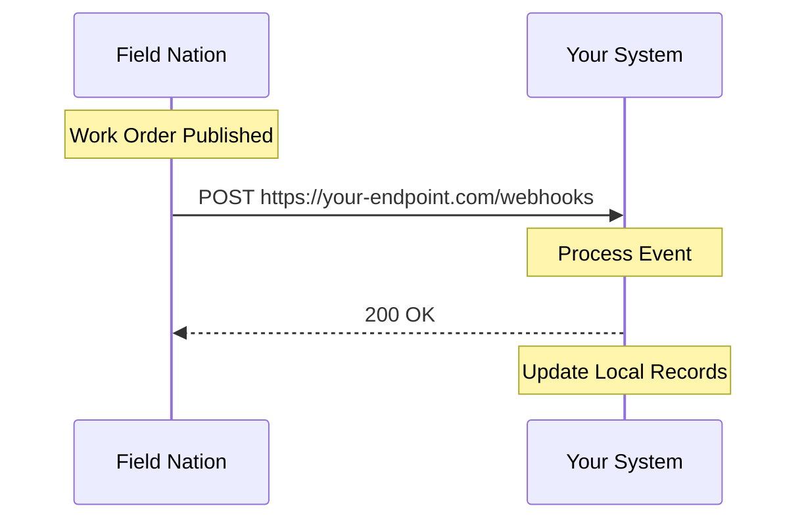

## What Are Webhooks?

Webhooks are **server-to-server HTTP callbacks** that notify your system when specific events happen in Field Nation. Think of them as "reverse API calls" – instead of your system asking Field Nation for updates, Field Nation pushes updates to you.

### How They Work

1. **Subscribe** - Register your HTTPS endpoint and select events to receive
2. **Event Occurs** - A work order is created, updated, or status changes
3. **Notification Sent** - Field Nation POSTs event payload to your endpoint
4. **Process & Respond** - Your system processes the event and returns 200 OK
5. **Automatic Retry** - If delivery fails, Field Nation retries with exponential backoff

---

## Why Use Webhooks?

<Cards>
  <Card title="Real-Time Synchronization" icon="Zap">
    Receive updates within seconds of events occurring. Keep your systems in sync without polling delays.
  </Card>
  <Card title="Reduced API Load" icon="TrendingDown">
    Eliminate constant polling. Webhooks push data only when something changes, reducing API calls by 95%+.
  </Card>
  <Card title="Event-Driven Architecture" icon="Workflow">
    Build reactive workflows that trigger automatically. Assign providers, update ERP systems, send notifications—all in real-time.
  </Card>
  <Card title="Cost Efficient" icon="DollarSign">
    Lower infrastructure costs. No need to run continuous polling jobs or maintain complex scheduling logic.
  </Card>
</Cards>

---

## Common Use Cases

### 1. **Work Order Lifecycle Automation**

Automatically respond to work order status changes:

- **Published** → Auto-assign to preferred provider
- **Assigned** → Update dispatch board, notify technician
- **Checked In** → Log start time in ERP system
- **Work Done** → Trigger approval workflow
- **Approved** → Generate invoice, update accounting system

### 2. **Real-Time Notifications**

Keep stakeholders informed instantly:

- Notify clients when work orders are completed
- Alert managers when providers decline assignments
- Send SMS/email when work is approved
- Update dashboards in real-time

### 3. **Data Synchronization**

Maintain consistent data across systems:

- Sync work order details to Salesforce, ServiceNow, or NetSuite
- Update custom dashboards and reporting tools
- Mirror Field Nation data in your database
- Replicate changes to multiple downstream systems

### 4. **Compliance & Auditing**

Track every change for regulatory requirements:

- Log all status transitions with timestamps
- Record who approved, declined, or modified work orders
- Maintain audit trails for compliance reporting
- Alert on specific event patterns

---

## When to Use Webhooks vs REST API

| Scenario | Use Webhooks | Use REST API |
|----------|-------------|--------------|
| **Real-time updates** | ✅ Ideal | ❌ Requires polling |
| **Event-driven workflows** | ✅ Perfect fit | ⚠️ Complex to implement |
| **Creating work orders** | ❌ Not supported | ✅ Use POST requests |
| **Bulk data queries** | ❌ Not designed for this | ✅ Use GET endpoints |
| **On-demand data retrieval** | ❌ Event-based only | ✅ Query anytime |
| **Reducing API calls** | ✅ Push notifications | ❌ Constant polling |

<Callout type="info">
**Best Practice**: Use webhooks for event-driven updates and REST API for on-demand queries and write operations. Most integrations use both together.
</Callout>

---

## Available Events

Field Nation Webhooks support **33 distinct events** covering the complete work order lifecycle:

### Event Categories

<Tabs items={["Lifecycle Events", "Status Changes", "Activity Events"]}>
  <Tab value="Lifecycle Events">
    - **workorder.created** - New work order created
    - **workorder.routed** - Routed to specific provider(s)
    - **workorder.requested** - Provider requested assignment
    - **workorder.declined** - Provider declined assignment
    - **workorder.undeclined** - Decline reversed
  </Tab>
  <Tab value="Status Changes">
    - **workorder.status.published** - Work order published to marketplace
    - **workorder.status.assigned** - Provider assigned to work order
    - **workorder.status.on_my_way** - Provider en route
    - **workorder.status.checked_in** - Provider arrived on site
    - **workorder.status.work_done** - Work completed
    - **workorder.status.approved** - Work approved by buyer
    - And 14 more status changes...
  </Tab>
  <Tab value="Activity Events">
    - **workorder.message_posted** - New message or reply
    - **workorder.provider_upload** - Document uploaded
    - **workorder.task_completed** - Task marked complete
    - **workorder.schedule_updated** - Schedule changed
    - **workorder.tag_added** / **tag_removed** - Tags modified
  </Tab>
</Tabs>

[View complete event catalog →](/docs/webhooks/concepts/events)

---

## Key Features

### 🔒 **Secure Delivery**

- **HMAC-SHA256 signatures** - Verify webhook authenticity
- **Custom headers** - Pass authentication tokens
- **IP whitelisting** - Restrict to Field Nation IPs
- **HTTPS required** - Encrypted transmission

[Learn about security →](/docs/webhooks/guides/security)

### 🔁 **Automatic Retries**

- **Exponential backoff** - 10s, 20s, 40s, 80s, 160s, 320s, 640s
- **Up to 7 attempts** - Based on delivery success rate
- **Manual retry** - Reprocess failed deliveries via API
- **Dead letter queue** - Access failed events for debugging

[Understanding delivery →](/docs/webhooks/concepts/delivery)

### 📊 **Comprehensive Monitoring**

- **Delivery logs** - Every attempt recorded
- **Pre-signed log URLs** - Access complete request/response
- **Filtering & search** - Find deliveries by event, status, work order
- **Change history** - Audit trail of webhook modifications

[Monitoring webhooks →](/docs/webhooks/guides/monitoring)

### 🛠️ **Flexible Management**

- **Web UI** - Visual webhook configuration dashboard
- **REST API** - Programmatic webhook management
- **Multiple webhooks** - Different endpoints per event type
- **Status control** - Active, inactive, or archived

[Creating webhooks →](/docs/webhooks/guides/creating-webhooks)

---

## Prerequisites

Before working with webhooks, ensure you have:

<Steps>

### Field Nation Account Access

- **Buyer account** with active contract
- **API credentials** (client_id and client_secret)
- **Webhook access** enabled (contact support if needed)

### Technical Requirements

- **HTTPS endpoint** - Publicly accessible URL
- **Response within 5 seconds** - Acknowledge deliveries quickly
- **2xx status code** - Indicate successful receipt

### Development Tools (Optional)

- **ngrok** or **localtunnel** - For local testing
- **Request inspection tools** - webhook.site, request.bin
- **Monitoring setup** - Logs, alerts, dashboards

</Steps>

[Complete prerequisites guide →](/docs/getting-started/prerequisites)

---

## Getting Started

Ready to receive your first webhook?

<Cards>
  <Card title="15-Minute Quickstart" icon="Rocket" href="/docs/webhooks/quickstart">
    Create your first webhook and receive events in under 15 minutes
  </Card>
  <Card title="Core Concepts" icon="Lightbulb" href="/docs/webhooks/concepts/events">
    Understand events, payloads, and delivery mechanics
  </Card>
  <Card title="Security Best Practices" icon="Shield" href="/docs/webhooks/guides/security">
    Verify signatures and secure your webhook endpoint
  </Card>
  <Card title="API Reference" icon="CodeXml" href="/docs/webhooks/api-reference/overview">
    Complete API documentation for programmatic management
  </Card>
</Cards>

---

## Need Help?

<Callout type="info">
**Support Resources**

- **Technical Issues**: [Submit a support case](https://app.fieldnation.com/support-cases)
- **Email**: integrations-engineering@fieldnation.com
- **API Playground**: [Swagger UI (Sandbox)](https://ui-sandbox.fndev.net/integrations/webhooks/_api)
</Callout>

---
