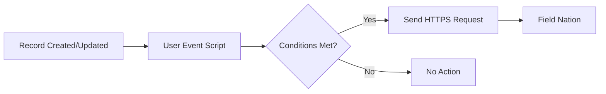

# Connectors: undefined
URL: /docs/connectors/platforms/netsuite/workflow
Source: content/docs/connectors/platforms/netsuite/workflow.mdx


---
title: Workflow Setup
description: Deploy SuiteScripts and configure NetSuite workflows to trigger Field Nation work order creation.
---

## Prerequisites

- ☐ [Field Nation configuration complete](/docs/connectors/platforms/netsuite/configuration)
- ☐ Trigger URL copied
- ☐ NetSuite admin/developer access
- ☐ SuiteScript knowledge (or developer available)

---

## NetSuite Integration Approach

NetSuite integration requires **SuiteScript deployment** to trigger webhooks:



---

## Step 1: Create SuiteScript

Deploy User Event Script to trigger on record changes:

### Sample SuiteScript 2.0

```javascript
/**
 * @NApiVersion 2.1
 * @NScriptType UserEventScript
 */
define(['N/https', 'N/record'], (https, record) => {
    
    const afterSubmit = (context) => {
        try {
            const newRecord = context.newRecord;
            const status = newRecord.getValue({ fieldId: 'status' });
            
            // Only trigger if status = "Ready for Dispatch"
            if (status === 'Ready for Dispatch') {
                
                const recordId = newRecord.id;
                const recordType = newRecord.type;
                
                // Field Nation trigger URL
                const fnUrl = 'https://api.fieldnation.com/integrations/trigger/{YOUR_CLIENT_TOKEN}';
                
                const payload = {
                    recordId: recordId,
                    recordType: recordType,
                    timestamp: new Date().toISOString()
                };
                
                const response = https.post({
                    url: fnUrl,
                    body: JSON.stringify(payload),
                    headers: {
                        'Content-Type': 'application/json'
                    }
                });
                
                log.audit({
                    title: 'Field Nation Trigger Sent',
                    details: 'Record ID: ' + recordId + ', Response: ' + response.code
                });
                
                // Optional: Update custom field to track sync
                // record.submitFields({
                //     type: recordType,
                //     id: recordId,
                //     values: { custbody_fn_synced: true }
                // });
            }
            
        } catch (e) {
            log.error({
                title: 'Field Nation Trigger Error',
                details: e.message
            });
        }
    };
    
    return {
        afterSubmit: afterSubmit
    };
});
```

---

## Step 2: Upload & Deploy Script

### Create Script File

Save the script as `fieldnation_trigger_ue.js`

### Upload to File Cabinet

Customization → Scripting → Scripts → Files → SuiteScripts → Upload

### Create Script Record

Customization → Scripting → Scripts → New

**Name**: Field Nation Trigger  
**ID**: `customscript_fn_trigger`  
**Script File**: Select uploaded file  
**Function**: `afterSubmit`

### Create Script Deployment

**Applied To**: Select record type (Service Order, Case, etc.)  
**Status**: Testing (initially)  
**Execute As Role**: Administrator  
**Log Level**: Debug (for testing)

**Audience**: All Roles

### Save Deployment

Click "Save"

---

## Step 3: Test Integration

### Create Test Record

1. Create Service Order in NetSuite
2. Set status to "Ready for Dispatch"
3. Save record

### Verify Script Execution

Customization → Scripting → Script Execution Log

Look for "Field Nation Trigger Sent" log entry

### Check Field Nation

Verify work order created with correct data

### Review Logs

Check for any errors in execution log

---

## Advanced Configuration

### Conditional Triggering

Add complex logic to SuiteScript:

```javascript
// Only trigger for specific subsidiaries
const subsidiary = newRecord.getValue({ fieldId: 'subsidiary' });
if (subsidiary !== 'US Operations') return;

// Only for high-priority orders
const priority = newRecord.getValue({ fieldId: 'priority' });
if (priority < 3) return;

// Check custom field
const sendToFN = newRecord.getValue({ fieldId: 'custbody_send_to_fn' });
if (!sendToFN) return;
```

---

### Prevent Duplicate Sends

```javascript
// Check if already synced
const fnSynced = newRecord.getValue({ fieldId: 'custbody_fn_synced' });
if (fnSynced) {
    log.audit('Already synced', 'Skipping');
    return;
}

// Send webhook...

// Mark as synced
record.submitFields({
    type: newRecord.type,
    id: newRecord.id,
    values: { custbody_fn_synced: true },
    options: { enableSourcing: false, ignoreMandatoryFields: true }
});
```

---

## Troubleshooting

  
    - Check deployment status = "Released"
    - Verify record type matches deployment
    - Check audience includes current user
    - Review script execution log for errors
  
  
  
    - Verify trigger URL correct
    - Check NetSuite outbound HTTPS enabled
    - Review Governance limits (10 HTTPS requests per script)
    - Test URL externally (curl/Postman)
  
  
  
    - Check Field Nation credentials valid
    - Verify SuiteTalk API accessible
    - Review Integration Broker logs
    - Test with minimal field set
  

---

## Production Deployment

### Test in Sandbox

Deploy and test in NetSuite sandbox account

### Update Script Status

Change deployment status to "Released"

### Monitor Execution

Watch script execution logs for first week

### Optimize

Adjust conditions, improve performance, reduce API calls

---