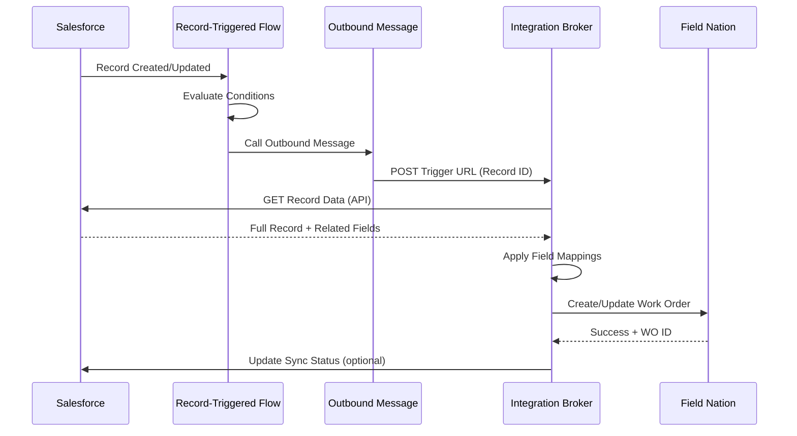

# Connectors: undefined
URL: /docs/connectors/platforms/salesforce/overview
Source: content/docs/connectors/platforms/salesforce/overview.mdx


---
title: Salesforce Connector
description: Integrate Salesforce CRM with Field Nation for automated work order creation and bidirectional status synchronization.
---

## Overview

The Salesforce connector enables seamless integration between Salesforce CRM and Field Nation:
- **Trigger-based creation**: Use Salesforce Flows to automatically create Field Nation work orders
- **Real-time sync**: Instant notification via Outbound Messages
- **Bidirectional messaging**: Sync comments between platforms
- **Flexible object support**: Works with standard or custom Salesforce objects
- **Related field access**: Map fields from parent/related objects

---

## At a Glance

  
    Username + Password + Security Token
  
  
    Any standard or custom object (Case, Opportunity, etc.)
  
  
    Record-Triggered Flows + Outbound Messages
  
  
    Bidirectional (create, update, messages)
  

---

## How It Works

### Configure Flow

Create record-triggered Flow in Salesforce that evaluates conditions (status change, checkbox, etc.)

### Call Outbound Message

Flow invokes Outbound Message to send record ID to Field Nation trigger URL

### Field Nation Fetches Data

Integration Broker retrieves complete record data from Salesforce API using configured credentials

### Apply Mappings

Broker applies field mappings and transformations to convert Salesforce data into Field Nation work order format

### Create Work Order

Transformed data creates or updates Field Nation work order with correlation ID stored for bidirectional sync

---

## Common Use Cases

### Dispatch from Case

Automatically create Field Nation work order when Case status changes to "On-site Required"

```
Case Status = "Dispatch Required" 
  → Flow triggers 
  → Outbound Message 
  → Field Nation Work Order Created
```

### Controlled Send via Checkbox

Use custom checkbox field to give users control over when to dispatch to Field Nation

```
"Send to Field Nation" checkbox = True
  → Flow triggers
  → Work order created
  → Checkbox reset or status updated
```

### Status Synchronization

Reflect Field Nation work order status and completion back to Salesforce Case

```
FN Work Order Status = "Completed"
  → Integration Broker
  → Salesforce Case Status = "Resolved"
  → Case Comment added with completion details
```

### Bidirectional Messaging

Sync comments and messages between Salesforce users and Field Nation technicians

```
Technician adds message in FN
  → Broker creates CaseComment in Salesforce
  
Salesforce user adds CaseComment
  → Flow triggers Outbound Message
  → Message appears in FN work order
```

---

## Architecture



---

## Features

### Field Mapping Capabilities

- **Standard Fields**: Case Subject, Description, Priority
- **Custom Fields**: Access any custom field on base object
- **Related Objects**: Map fields from Account, Contact, Owner, etc.
- **Lookup Fields**: Access related record data (e.g., Account.Name)
- **Formula Fields**: Use calculated field values
- **Picklist Values**: Map Salesforce picklists to Field Nation enums

### Supported Operations

---

## Prerequisites

### Salesforce Requirements

  
    - Create and modify Flows
    - Configure Outbound Messages
    - Manage API users and permissions
    - Access Setup menu
  
  
  
    - Salesforce user with API access enabled
    - Read permissions on all fields to sync FROM Salesforce
    - Write permissions on all fields to sync TO Salesforce
    - Access to base object and related objects
  
  
  
    - Generate security token from Salesforce personal settings
    - Select "Reset My Security Token"
    - Token will be emailed to registered email address
    - Keep token secure (treat like a password)
  
  
  
    - Allow API access (not blocked by Profile/Permission Set)
    - Whitelist Field Nation IP addresses if using IP restrictions
    - Enable "API Enabled" permission for integration user
  

### Field Nation Requirements

- Active buyer account with admin access
- Integration settings access
- Sandbox environment (recommended for testing)

[Complete prerequisites →](/docs/connectors/getting-started)

---

## Authentication

The Salesforce connector uses **Username-Password flow** with security token:

```
Authentication = Username + Password + SecurityToken
Instance = production | test (sandbox)
```

**Format:**
- **Username**: Full email address (e.g., `integration@company.com`)
- **Password**: Salesforce password
- **Security Token**: System-generated key from Salesforce

**Instance Types:**
- **production**: Connect to live Salesforce org (`login.salesforce.com`)
- **test**: Connect to sandbox environment (`test.salesforce.com`)

> **Security Best Practice**: Create dedicated integration user instead of using personal account. This provides better security, audit trails, and prevents integration breakage if personal account is deactivated.

---

## Data Flow Patterns

### Inbound: Salesforce → Field Nation

**Trigger**: Record-Triggered Flow evaluates conditions  
**Action**: Outbound Message sends record ID to Field Nation  
**Result**: Field Nation work order created/updated

**Example Flow Conditions:**
- Case Status = "Dispatch Required"
- Custom Checkbox "Send to FN" = True
- Priority = "High" AND Type = "On-site"
- Record Type = "Field Service"

---

### Outbound: Field Nation → Salesforce

**Trigger**: Field Nation work order event (assigned, completed, etc.)  
**Action**: Integration Broker calls Salesforce API  
**Result**: Salesforce Case/record updated with status/comments

**Configurable Events:**
- Work order assigned → Update Case Status
- Work order completed → Add CaseComment with details
- Provider checked in → Update custom field "Technician Arrived"
- Work order approved → Update Case Status to "Resolved"

---

## Best Practices

### Flow Design

- ✅ Use specific trigger conditions (avoid "any field changed")
- ✅ Add safeguards to prevent duplicate sending
- ✅ Test with sandbox Salesforce and Field Nation environments
- ✅ Handle failures gracefully (don't block record saves)
- ✅ Log Flow execution for debugging

### Field Mappings

- ✅ Map all required Field Nation fields
- ✅ Use default values for optional fields
- ✅ Test with various Salesforce record states
- ✅ Handle null/empty values appropriately
- ✅ Document mapping logic for maintenance

### Security

- ✅ Use dedicated integration user (not personal account)
- ✅ Rotate security token periodically
- ✅ Grant minimum required permissions
- ✅ Monitor API usage and limits
- ✅ Enable IP whitelisting if security policy requires

---

## Limitations & Considerations

### API Limits

Salesforce enforces API call limits based on license type:
- **Enterprise**: 1,000 calls/day (min)
- **Unlimited**: 5,000 calls/day (min)
- **Additional**: Available for purchase

Each work order sync consumes **2-3 API calls** (authentication + data retrieval + optional status update).

[Monitor API usage in Salesforce Setup → System Overview]

### Related Object Depth

The connector can access:
- ✅ Fields on base object (Case, Opportunity, etc.)
- ✅ Fields on directly related parent objects (Account, Contact, Owner)
- ❌ Grand-parent or distant relationships (requires custom JSONNET)

**Example Access:**
- ✅ `Case.Account.Name` - Direct parent
- ✅ `Case.Contact.Email` - Direct relationship
- ❌ `Case.Account.Parent.Name` - Two levels up (not automatic)

### Outbound Message Behavior

- Salesforce retries failed Outbound Messages for 24 hours
- Integration Broker responds within seconds to prevent retries
- If Broker is down, Salesforce will retry (may cause duplicates)
- Implement idempotency using correlation IDs

---