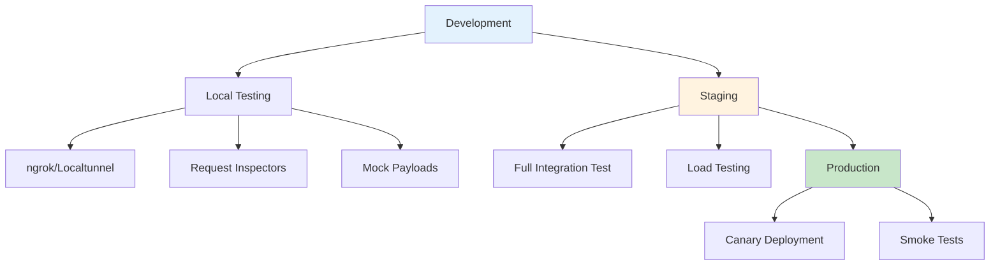

# Webhooks: undefined
URL: /docs/webhooks/guides/testing
Source: content/docs/webhooks/guides/testing.mdx


---
title: Testing Webhooks
description: Test webhooks locally using ngrok, request inspectors, and mock payloads. Strategies for development, staging, and production testing.
---

## Testing Strategy



---

## Local Testing Tools

### 1. ngrok (Recommended)

**Best for**: Testing with real Field Nation webhooks locally

#### Setup

```bash
# Install ngrok
brew install ngrok/ngrok/ngrok

# Or download from https://ngrok.com/download

# Authenticate
ngrok authtoken YOUR_NGROK_TOKEN

# Start tunnel to local port
ngrok http 3000
```

**Output:**

```plaintext
Session Status                online
Account                       your-account (Plan: Free)
Version                       3.x.x
Region                        United States (us)
Latency                       -
Web Interface                 http://127.0.0.1:4040
Forwarding                    https://abc123.ngrok-free.app -> http://localhost:3000

Connections                   ttl     opn     rt1     rt5     p50     p90
                              0       0       0.00    0.00    0.00    0.00
```

#### Using ngrok URL

1. **Copy the HTTPS URL**: `https://abc123.ngrok-free.app`
2. **Create webhook** with URL: `https://abc123.ngrok-free.app/webhooks/fieldnation`
3. **Test**: Trigger events in Field Nation sandbox

> [INFO] **Web Interface**: Visit `http://127.0.0.1:4040` to see all requests in real-time, including headers and payloads.

#### Advanced ngrok Configuration

```yaml title="ngrok.yml"
version: "2"
authtoken: YOUR_NGROK_TOKEN

tunnels:
  webhook:
    proto: http
    addr: 3000
    hostname: your-custom-domain.ngrok-free.app
    inspect: true
    bind_tls: true
```

Start named tunnel:

```bash
ngrok start webhook
```

---

### 2. localtunnel

**Alternative to ngrok** - no account required

```bash
# Install
npm install -g localtunnel

# Start tunnel
lt --port 3000 --subdomain my-webhook

# Output: https://my-webhook.loca.lt
```

---

### 3. Request Inspectors

Perfect for viewing webhook payloads without writing code.

#### webhook.site

1. Visit [webhook.site](https://webhook.site)
2. Copy your unique URL
3. Create webhook with that URL
4. View requests in real-time

**Features:**
- No signup required
- See headers, body, query params
- Custom responses
- Request history

#### RequestBin / Request.bin

Similar to webhook.site:

1. Visit [requestbin.com](https://requestbin.com)
2. Create a bin
3. Use bin URL as webhook endpoint
4. View all requests

---

## Local Development Setup

### Complete Testing Environment

```javascript title="test-webhook-server.js"
const express = require('express');
const crypto = require('crypto');
const app = express();

// Environment
const PORT = process.env.PORT || 3000;
const WEBHOOK_SECRET = process.env.WEBHOOK_SECRET || 'test-secret';

// Middleware
app.use(express.raw({ type: 'application/json' }));

// Health check
app.get('/health', (req, res) => {
  res.json({ status: 'ok', timestamp: new Date().toISOString() });
});

// Webhook endpoint with full logging
app.post('/webhooks/fieldnation', (req, res) => {
  console.log('\n=== WEBHOOK RECEIVED ===');
  console.log('Timestamp:', new Date().toISOString());
  
  // Log headers
  console.log('\nHeaders:');
  Object.entries(req.headers).forEach(([key, value]) => {
    if (key.startsWith('x-fn-') || key === 'content-type') {
      console.log(`  ${key}: ${value}`);
    }
  });
  
  // Verify signature
  const signature = req.headers['x-fn-signature'];
  const isValid = verifySignature(req.body, signature, WEBHOOK_SECRET);
  console.log(`\nSignature Valid: ${isValid}`);
  
  if (!isValid) {
    console.log('❌ SIGNATURE VERIFICATION FAILED');
    return res.status(401).send('Unauthorized');
  }
  
  // Parse payload
  const payload = JSON.parse(req.body.toString());
  
  // Log event details
  console.log('\nEvent Details:');
  console.log(`  Event ID: ${payload.eventId}`);
  console.log(`  Event Name: ${payload.eventName}`);
  console.log(`  Work Order ID: ${payload.workOrderId}`);
  console.log(`  Timestamp: ${payload.timestamp}`);
  
  // Log payload preview
  console.log('\nPayload Preview:');
  console.log(JSON.stringify(payload, null, 2).substring(0, 500) + '...');
  
  console.log('\n✅ Webhook processed successfully');
  console.log('=======================\n');
  
  // Respond
  res.status(200).send('OK');
});

function verifySignature(rawBody, signature, secret) {
  if (!signature) return false;
  
  const [algorithm, hash] = signature.split('=');
  const expectedHash = crypto
    .createHmac(algorithm, secret)
    .update(rawBody)
    .digest('hex');
  
  return crypto.timingSafeEqual(
    Buffer.from(expectedHash),
    Buffer.from(hash)
  );
}

app.listen(PORT, () => {
  console.log(`🚀 Webhook test server running on port ${PORT}`);
  console.log(`📝 Health check: http://localhost:${PORT}/health`);
  console.log(`📨 Webhook endpoint: http://localhost:${PORT}/webhooks/fieldnation`);
  console.log(`\n🔐 Using secret: ${WEBHOOK_SECRET}`);
  console.log('\n⏳ Waiting for webhooks...\n');
});
```

**Run:**

```bash
# Set secret (get from webhook creation)
export WEBHOOK_SECRET=your-webhook-secret

# Start server
node test-webhook-server.js

# In another terminal, start ngrok
ngrok http 3000
```

---

## Mock Webhook Payloads

Test your processing logic with realistic payloads:

### Work Order Published Event

```json title="mock-payloads/workorder-published.json"
{
  "eventName": "workorder.status.published",
  "eventId": "evt_test_001",
  "workOrderId": 99999,
  "timestamp": "2025-01-15T10:30:00.000Z",
  "data": {
    "id": 99999,
    "title": "Test Router Installation",
    "description": "This is a test work order for webhook testing",
    "status": "published",
    "type": "installation",
    "schedule": {
      "serviceWindow": {
        "start": "2025-01-20T09:00:00Z",
        "end": "2025-01-20T17:00:00Z",
        "mode": "hours"
      }
    },
    "location": {
      "address1": "123 Test Street",
      "city": "San Francisco",
      "state": "CA",
      "zip": "94105",
      "coordinates": {
        "latitude": 37.7749,
        "longitude": -122.4194
      }
    },
    "pay": {
      "type": "fixed",
      "amount": 250.00,
      "currency": "USD"
    },
    "buyer": {
      "id": 456,
      "name": "Test Company",
      "companyId": 789
    },
    "tags": ["test", "router"],
    "customFields": {
      "testField": "test-value"
    },
    "createdAt": "2025-01-15T10:00:00Z",
    "updatedAt": "2025-01-15T10:30:00Z"
  }
}
```

### Work Order Assigned Event

```json title="mock-payloads/workorder-assigned.json"
{
  "eventName": "workorder.status.assigned",
  "eventId": "evt_test_002",
  "workOrderId": 99999,
  "timestamp": "2025-01-15T11:00:00.000Z",
  "data": {
    "id": 99999,
    "title": "Test Router Installation",
    "status": "assigned",
    "provider": {
      "id": 12345,
      "name": "John Test Provider",
      "userId": 67890,
      "rating": 4.8,
      "completedJobs": 150
    },
    "schedule": {
      "serviceWindow": {
        "start": "2025-01-20T09:00:00Z",
        "end": "2025-01-20T17:00:00Z"
      }
    }
  }
}
```

### Send Mock Payload

```bash title="send-mock-webhook.sh"
#!/bin/bash

WEBHOOK_URL="http://localhost:3000/webhooks/fieldnation"
WEBHOOK_SECRET="your-webhook-secret"
PAYLOAD_FILE="mock-payloads/workorder-published.json"

# Read payload
PAYLOAD=$(cat $PAYLOAD_FILE)

# Generate signature
SIGNATURE=$(echo -n "$PAYLOAD" | openssl dgst -sha256 -hmac "$WEBHOOK_SECRET" | awk '{print $2}')

# Send request
curl -X POST "$WEBHOOK_URL" \
  -H "Content-Type: application/json" \
  -H "x-fn-signature: sha256=$SIGNATURE" \
  -H "x-fn-webhook-id: wh_test_123" \
  -H "x-fn-event-name: workorder.status.published" \
  -H "x-fn-delivery-id: del_test_001" \
  -H "x-fn-timestamp: $(date -u +"%Y-%m-%dT%H:%M:%SZ")" \
  -d "$PAYLOAD" \
  -v
```

**Make executable and run:**

```bash
chmod +x send-mock-webhook.sh
./send-mock-webhook.sh
```

### Node.js Mock Sender

```javascript title="send-mock-webhook.js"
const crypto = require('crypto');
const fetch = require('node-fetch');
const fs = require('fs');

async function sendMockWebhook(payloadPath, webhookUrl, secret) {
  // Read payload
  const payload = JSON.parse(fs.readFileSync(payloadPath, 'utf8'));
  const payloadString = JSON.stringify(payload);
  
  // Generate signature
  const signature = crypto
    .createHmac('sha256', secret)
    .update(payloadString)
    .digest('hex');
  
  // Send request
  const response = await fetch(webhookUrl, {
    method: 'POST',
    headers: {
      'Content-Type': 'application/json',
      'x-fn-signature': `sha256=${signature}`,
      'x-fn-webhook-id': 'wh_test_123',
      'x-fn-event-name': payload.eventName,
      'x-fn-delivery-id': `del_test_${Date.now()}`,
      'x-fn-timestamp': new Date().toISOString()
    },
    body: payloadString
  });
  
  console.log('Response Status:', response.status);
  console.log('Response Body:', await response.text());
}

// Usage
sendMockWebhook(
  './mock-payloads/workorder-published.json',
  'http://localhost:3000/webhooks/fieldnation',
  'your-webhook-secret'
);
```

---

## Testing Strategies by Environment

### Development Environment

**Goal**: Rapid iteration and debugging

### Use Request Inspector

Start with webhook.site to see raw payloads without writing code.

### Local Server + ngrok

Once you understand the payload structure, build your handler locally.

### Mock Payloads

Test specific scenarios without triggering real events.

### Signature Verification

Always test signature validation logic.

### Error Scenarios

Test invalid signatures, malformed payloads, timeouts.

---

### Staging Environment

**Goal**: Full integration testing before production

```javascript title="staging-test-suite.js"
const assert = require('assert');

describe('Webhook Integration Tests', () => {
  it('should receive and process work order published event', async () => {
    // 1. Create test work order in sandbox
    const workOrder = await createTestWorkOrder();
    
    // 2. Publish work order (triggers webhook)
    await publishWorkOrder(workOrder.id);
    
    // 3. Wait for webhook processing
    await sleep(5000);
    
    // 4. Verify webhook was received
    const logs = await getProcessedEvents();
    const event = logs.find(log =>
      log.workOrderId === workOrder.id &&
      log.eventName === 'workorder.status.published'
    );
    
    assert.ok(event, 'Webhook event not found');
    assert.equal(event.status, 'processed');
    
    // 5. Verify downstream effects
    const salesforceRecord = await getSalesforceRecord(workOrder.id);
    assert.ok(salesforceRecord, 'Work order not synced to Salesforce');
  });
  
  it('should handle duplicate webhooks idempotently', async () => {
    const payload = getMockPayload();
    
    // Send same webhook twice
    await sendWebhook(payload);
    await sendWebhook(payload);
    
    // Verify processed only once
    const processCount = await getProcessingCount(payload.eventId);
    assert.equal(processCount, 1, 'Webhook processed more than once');
  });
  
  it('should retry failed processing', async () => {
    // Temporarily break downstream service
    await disableSalesforceSync();
    
    // Send webhook
    const payload = getMockPayload();
    await sendWebhook(payload);
    
    // Verify failed
    await sleep(2000);
    let status = await getProcessingStatus(payload.eventId);
    assert.equal(status, 'failed');
    
    // Fix service
    await enableSalesforceSync();
    
    // Verify retry succeeded
    await sleep(15000); // Wait for retry
    status = await getProcessingStatus(payload.eventId);
    assert.equal(status, 'processed');
  });
});
```

**Run staging tests:**

```bash
# Set staging environment
export NODE_ENV=staging
export WEBHOOK_URL=https://staging.example.com/webhooks
export FN_CLIENT_ID=staging-client-id
export FN_CLIENT_SECRET=staging-secret

# Run tests
npm test
```

---

### Production Environment

**Goal**: Verify production deployment without disrupting operations

#### Smoke Tests

```javascript title="production-smoke-test.js"
async function runSmokeTests() {
  const tests = {
    webhookEndpoint: false,
    signatureVerification: false,
    queueHealth: false,
    downstreamServices: false
  };
  
  // Test 1: Webhook endpoint responsive
  try {
    const response = await fetch('https://api.example.com/health');
    tests.webhookEndpoint = response.ok;
  } catch (error) {
    console.error('Webhook endpoint test failed:', error);
  }
  
  // Test 2: Signature verification working
  try {
    const testPayload = getMockPayload();
    const signature = generateSignature(testPayload, process.env.WEBHOOK_SECRET);
    const response = await sendWebhook(testPayload, signature);
    tests.signatureVerification = response.status === 200;
  } catch (error) {
    console.error('Signature test failed:', error);
  }
  
  // Test 3: Queue healthy
  try {
    const queueSize = await getQueueSize();
    tests.queueHealth = queueSize < 1000;
  } catch (error) {
    console.error('Queue health test failed:', error);
  }
  
  // Test 4: Downstream services accessible
  try {
    await Promise.all([
      checkSalesforce(),
      checkDatabase(),
      checkRedis()
    ]);
    tests.downstreamServices = true;
  } catch (error) {
    console.error('Downstream services test failed:', error);
  }
  
  // Report
  const allPassed = Object.values(tests).every(t => t);
  
  console.log('\n=== Smoke Test Results ===');
  Object.entries(tests).forEach(([test, passed]) => {
    console.log(`  ${passed ? '✅' : '❌'} ${test}`);
  });
  console.log(`\nOverall: ${allPassed ? '✅ PASSED' : '❌ FAILED'}`);
  
  return allPassed;
}

// Run after deployment
runSmokeTests().then(passed => {
  process.exit(passed ? 0 : 1);
});
```

#### Canary Deployment

```javascript
// Create separate webhook for testing
const canaryWebhook = await createWebhook({
  url: 'https://api-canary.example.com/webhooks',
  status: 'active',
  events: ['workorder.status.published'], // Single event for testing
  notificationEmail: 'canary-alerts@example.com'
});

// Monitor canary for issues
await monitorCanary(canaryWebhook.webhookId, {
  duration: '1 hour',
  successRateThreshold: 99,
  onSuccess: () => {
    console.log('Canary successful, promoting to production');
    // Update main webhook to new version
  },
  onFailure: () => {
    console.log('Canary failed, rolling back');
    // Deactivate canary, keep old version
  }
});
```

---

## Load Testing

Test webhook handling under high volume:

```javascript title="load-test.js"
const autocannon = require('autocannon');

async function loadTest() {
  const result = await autocannon({
    url: 'http://localhost:3000/webhooks/fieldnation',
    connections: 100,        // Concurrent connections
    duration: 30,            // 30 seconds
    pipelining: 1,
    method: 'POST',
    headers: {
      'Content-Type': 'application/json',
      'x-fn-signature': 'sha256=test-signature',
      'x-fn-webhook-id': 'wh_load_test',
      'x-fn-event-name': 'workorder.status.published'
    },
    body: JSON.stringify(getMockPayload())
  });
  
  console.log('\n=== Load Test Results ===');
  console.log(`Requests: ${result.requests.total}`);
  console.log(`Duration: ${result.duration}s`);
  console.log(`RPS: ${result.requests.average}`);
  console.log(`Latency p50: ${result.latency.p50}ms`);
  console.log(`Latency p95: ${result.latency.p95}ms`);
  console.log(`Latency p99: ${result.latency.p99}ms`);
  console.log(`Errors: ${result.errors}`);
  console.log(`Timeouts: ${result.timeouts}`);
}

loadTest();
```

---

## Testing Checklist

### Local Testing
- ✅ Set up local server with logging
- ✅ Use ngrok for public URL
- ✅ Test with request inspector first
- ✅ Verify signature validation
- ✅ Test with mock payloads
- ✅ Test error scenarios

### Staging Testing
- ✅ Full integration tests
- ✅ Test all event types
- ✅ Verify idempotency
- ✅ Test retry logic
- ✅ Load testing
- ✅ Monitor for 24 hours

### Production Testing
- ✅ Smoke tests after deployment
- ✅ Canary deployment
- ✅ Monitor metrics closely
- ✅ Have rollback plan ready
- ✅ Test error handling
- ✅ Verify monitoring/alerts

---